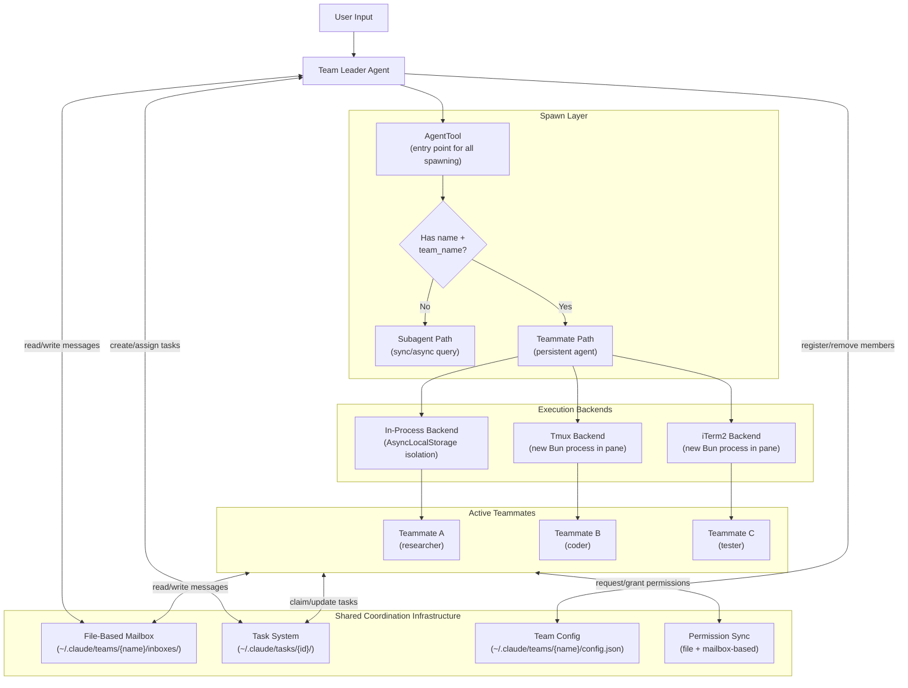
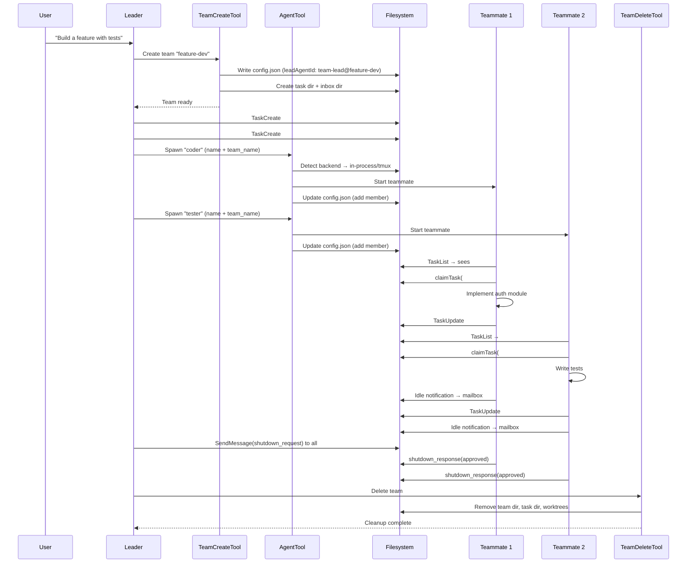

# Multi-Agent Orchestration System

Claude Code implements a production-grade multi-agent coordination framework. Agents can be spawned as lightweight in-process coroutines or as full separate processes in tmux/iTerm2 panes. They coordinate through a file-based mailbox system and a shared task list with file-level locking for concurrent safety.

## Architecture Overview

## Subsystem Documentation

| Document | Covers |
|----------|--------|
| [AgentTool](multi-agent/AGENT_TOOL.md) | The unified entry point for all agent spawning — schema, execution paths, fork experiment, result formatting, error handling, feature flags |
| [Spawning & Backends](multi-agent/SPAWNING.md) | How teammates are actually created — backend detection, in-process vs pane-based spawning, CLI flag/env propagation, process lifecycle |
| [Teams & Coordinator](multi-agent/TEAMS.md) | Team creation/deletion, team file structure, AppState integration, coordinator mode system prompt, color assignment, session cleanup |
| [Communication](multi-agent/COMMUNICATION.md) | File-based mailbox, SendMessage routing, structured message protocols, inbox polling, inter-agent message delivery |
| [Task System](multi-agent/TASK_SYSTEM.md) | Task data model, ID generation, file locking, claiming, dependencies, hooks, UI display, task list resolution |
| [In-Process Runner](multi-agent/IN_PROCESS_RUNNER.md) | The teammate execution loop — permission bridging, mailbox polling, idle detection, auto-compaction, system prompt assembly, abort propagation |
| [Worktree Isolation](multi-agent/WORKTREES.md) | Git worktree creation/cleanup, sparse checkout, symlinks, post-creation setup, stale worktree cleanup |

## Complete Team Lifecycle

## Key Design Decisions

1. **File-based coordination over IPC**: All inter-agent communication uses JSON files with `proper-lockfile` for concurrent safety. This works across both in-process and separate-process backends without protocol differences.

2. **AsyncLocalStorage for in-process isolation**: Multiple teammates run in the same Node.js event loop but with fully isolated contexts via `AsyncLocalStorage`. No shared mutable state leaks between agents.

3. **High-water-mark task IDs**: Task IDs are never reused, even after deletion or team reset. A `.highwatermark` file persists the maximum ID ever assigned.

4. **Prompt cache optimization (fork path)**: When forking subagents, the system constructs byte-identical message prefixes across all children to maximize API prompt cache hits. Only the per-child directive differs.

5. **Graceful shutdown negotiation**: Teammates aren't force-killed. The leader sends a `shutdown_request` message, and the teammate's LLM decides whether to approve or reject based on its current state.

6. **Permission bridging**: In-process teammates route permission prompts through the leader's UI dialog (with colored worker badges). If the UI is unavailable, they fall back to mailbox-based permission requests.
