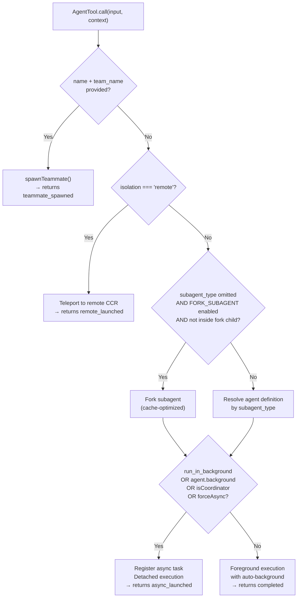
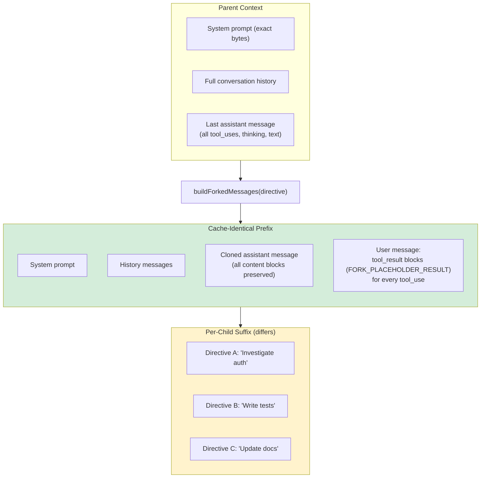
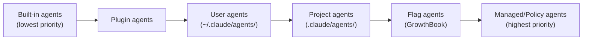
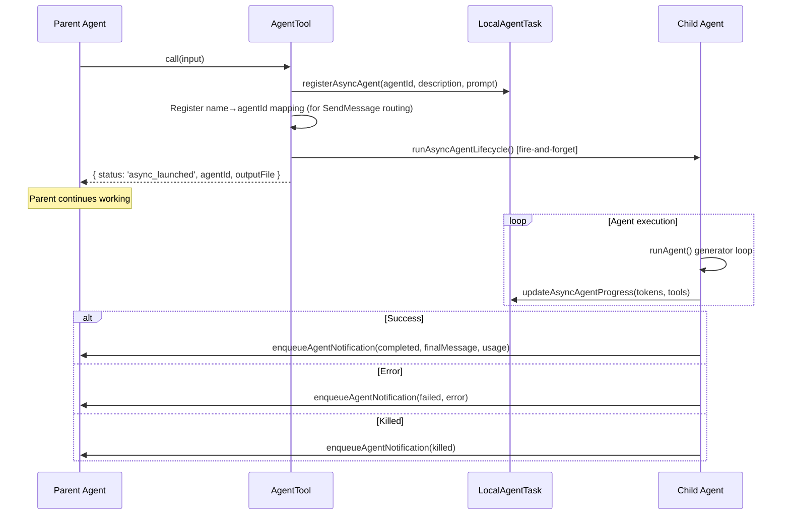
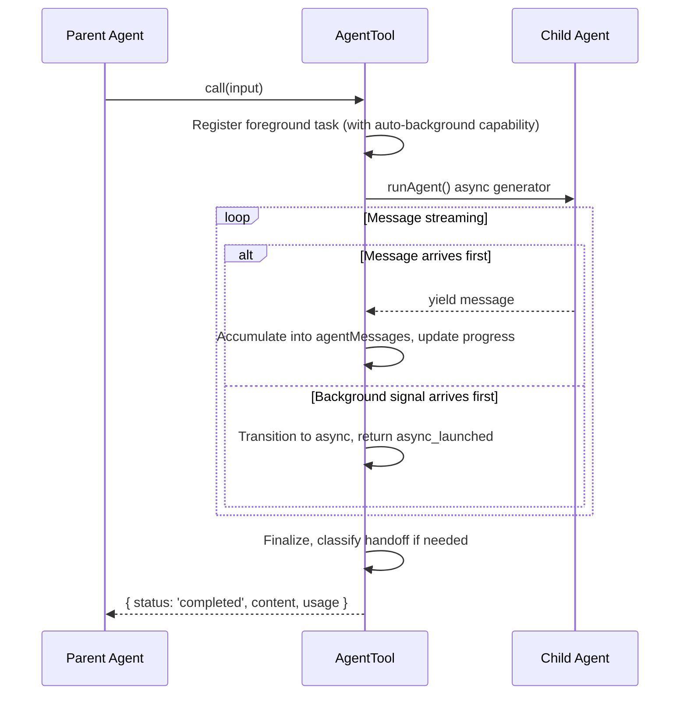

# AgentTool — The Unified Agent Spawning Entry Point

**Source**: `src/tools/AgentTool/AgentTool.tsx` (~1400 lines)

The AgentTool is the single entry point for all agent spawning in Claude Code. It handles four distinct execution paths depending on the input parameters and feature flags.

## Input Schema

The schema is built dynamically based on active feature flags:

```typescript
// Always present
{
  description: z.string()         // 3-5 word task summary (required)
  prompt: z.string()              // Full task instructions (required)
  subagent_type: z.string()       // Agent type to spawn (optional)
  model: z.enum(['sonnet', 'opus', 'haiku'])  // Model override (optional)
  run_in_background: z.boolean()  // Async execution (optional)
}

// When agent teams feature is enabled
{
  name: z.string()                // Teammate name (triggers team spawn path)
  team_name: z.string()           // Team to spawn in
  mode: permissionModeSchema()    // 'plan' | 'acceptEdits' | 'auto' | 'bypassPermissions' | 'default'
}

// Isolation parameters
{
  isolation: z.enum(['worktree', 'remote'])  // Worktree or remote CCR isolation
  cwd: z.string()                            // Working directory override (KAIROS-gated)
}
```

The schema uses `z.lazy()` so that conditional field inclusion doesn't break type inference. Fields like `cwd` and `run_in_background` are omitted entirely when their backing feature flags are disabled.

## Execution Path Decision Tree



## Path 1: Team Teammate Spawn

Triggered when both `name` and `team_name` are provided.

**Validations:**
- Agent teams feature must be available
- A teammate cannot spawn another teammate (single nesting level)
- In-process teammates cannot spawn background agents
- Team must exist (from prior `TeamCreateTool` call)

**Flow:**
1. Resolve team context from AppState
2. Generate unique teammate name (appends `-2`, `-3` if duplicates exist)
3. Call `spawnTeammate()` from `spawnMultiAgent.ts`
4. Return `{ status: 'teammate_spawned', agent_id, name, team_name }`

## Path 2: Remote Agent (ant-only)

Triggered when `isolation === 'remote'`. Creates a remote Claude Code Runtime session.

## Path 3: Fork Subagent (Experimental)

Triggered when `subagent_type` is omitted and the `FORK_SUBAGENT` feature flag is enabled.

**Source**: `src/tools/AgentTool/forkSubagent.ts`

### Eligibility

```typescript
function isForkSubagentEnabled(): boolean {
  return feature('FORK_SUBAGENT')
    && !isCoordinatorMode()
    && !getIsNonInteractiveSession()
}
```

### Recursive Fork Guard

The system prevents fork children from forking again by scanning user messages for a `<fork-boilerplate-tag>`:

```typescript
function isInForkChild(messages: Message[]): boolean {
  // Scans user messages for the boilerplate tag
  // If found, this is a fork child — cannot fork further
}
```

### Fork Agent Definition

```typescript
const FORK_AGENT = {
  agentType: 'fork',
  tools: ['*'],           // All parent tools
  useExactTools: true,     // Use parent's exact tool set (cache-identical)
  maxTurns: 200,
  model: 'inherit',        // Same model as parent (cache-identical)
  permissionMode: 'bubble', // Permission prompts surface to parent
}
```

### Cache-Optimized Message Building

The key innovation of fork subagents is **byte-identical message prefixes** across all fork children to maximize API prompt cache hits.



**`buildForkedMessages(directive, assistantMessage)`:**

1. Clone the full assistant message (all content blocks: thinking, text, tool_uses)
2. Extract every `tool_use` block from the assistant message
3. Create a `tool_result` block for each with an identical `FORK_PLACEHOLDER_RESULT` string
4. Build a single user message: `[...tool_results, directive_text]`
5. Return `[cloned_assistant, user_message]`

The only bytes that differ per child are the directive text at the end of the user message. Everything before it is identical → prompt cache hit.

**`buildChildMessage(directive)`** wraps the directive in XML with strict behavioral rules:

```
Rules injected into fork children:
1. You ARE the fork, not the parent
2. Don't converse, ask questions, or suggest — just do
3. Use tools directly (Bash, Read, Write, etc.)
4. No text between tool calls
5. Commit changes before reporting
6. Stay in scope
7. Keep report under 500 words
8. Start with "Scope:", no preamble
```

Output format enforced:
```
Scope: <one-sentence scope echo>
Result: <findings, limited to scope>
Key files: <relevant paths>
Files changed: <list with commit hash>
Issues: <list if any>
```

## Path 4: Normal Subagent

Triggered when `subagent_type` is provided (or the fork path is ineligible).

### Agent Definition Resolution

**Source**: `src/tools/AgentTool/loadAgentsDir.ts`

Agent definitions come from multiple sources with a priority hierarchy (last wins):



Each agent definition contains:
```typescript
interface AgentDefinition {
  agentType: string              // e.g., "Explore", "Plan", "code-reviewer"
  source: 'built-in' | 'userSettings' | 'projectSettings' | 'plugin' | ...
  getSystemPrompt: (params?) => string
  tools?: string[]               // Tool allowlist ('*' for all)
  useExactTools?: boolean        // Use exact tool set (no filtering)
  model?: string                 // 'inherit' | 'sonnet' | 'opus' | 'haiku'
  maxTurns?: number
  permissionMode?: PermissionMode
  background?: boolean           // Force async execution
  mcpServers?: McpServerConfig[] // Required MCP servers
  requiresMcpServers?: string[]  // MCP server name patterns
}
```

MCP server requirements are checked before agent selection:
```typescript
function hasRequiredMcpServers(agent, availableServers): boolean {
  // Each required pattern must match at least one available server
  // (case-insensitive substring match)
}
```

## Sync vs Async Execution

### Async Decision

```typescript
const shouldRunAsync = (
  run_in_background === true ||
  selectedAgent.background === true ||
  isCoordinator ||
  forceAsync ||                    // Fork path
  assistantForceAsync ||           // KAIROS feature
  proactiveModule?.isProactiveActive()
) && !isBackgroundTasksDisabled
```

### Async Execution Flow



### Sync Execution Flow



The sync path supports **mid-execution transition to background**: if the user presses a background hotkey, the `backgroundPromise` resolves and the agent seamlessly transitions to async mode.

### Auto-Background

When `tengu_auto_background_agents` is enabled, sync agents automatically transition to background after 120 seconds of execution.

## Worktree Isolation

When `isolation: 'worktree'` is specified:

1. Create a git worktree with slug `agent-{8-char-random-id}`
2. Agent runs in the isolated working directory
3. On completion:
   - **No changes detected**: Remove worktree, return result without worktree metadata
   - **Changes detected**: Keep worktree, return `{ worktreePath, worktreeBranch }` in result

On the fork path, a worktree notice is injected telling the child to re-read files (parent context may be stale) and that changes stay isolated.

## Result Formatting

### Completed (Sync)
```typescript
{
  status: 'completed',
  prompt: string,
  content: ContentBlock[],  // Agent's final response
  usage: { totalTokens, toolUses, durationMs },
  worktreePath?: string,
  worktreeBranch?: string
}
```

### Async Launched
```typescript
{
  status: 'async_launched',
  agentId: string,           // For SendMessage routing
  description: string,
  prompt: string,
  outputFile: string,        // Transcript path (for progress checks)
  canReadOutputFile: boolean
}
```

### Teammate Spawned
```typescript
{
  status: 'teammate_spawned',
  agent_id: string,
  name: string,
  team_name: string
  // "will receive instructions via mailbox"
}
```

## runAgent() — The Agent Execution Engine

**Source**: `src/tools/AgentTool/runAgent.ts` (~970 lines)

This is the core async generator that drives any agent's execution loop.

```mermaid
flowchart TD
    Start["runAgent() called"]

    subgraph Init["Initialization"]
        ResolveModel["Resolve model<br/>(explicit → agent.model → parent.mainLoopModel)"]
        GenId["Generate agentId or use override"]
        FilterCtx["Filter system/user context<br/>(omit claudeMd for Explore/Plan)"]
        PermMode["Apply permission mode overrides"]
        ResolveTools["Resolve tools from agent definition"]
        InitMCP["Initialize agent-specific MCP servers<br/>Merge with parent MCP clients"]
    end

    subgraph Hooks["Hook & Skill Loading"]
        RegHooks["Register frontmatter hooks<br/>(scoped to agent lifetime)"]
        PreloadSkills["Resolve and preload skills<br/>(exact → plugin-prefixed → suffix match)"]
        AddSkillMsgs["Add skill contents as initial messages"]
    end

    subgraph Context["Context Assembly"]
        CreateCtx["createSubagentContext()<br/>(isolated file cache, abort controller)"]
        CacheSafe["Call onCacheSafeParams callback<br/>(for fork cache sharing)"]
        RecordMeta["Record initial messages to transcript"]
    end

    subgraph QueryLoop["Query Loop"]
        CallQuery["query() generator"]
        FilterStream["Filter stream events"]
        RecordMsg["Record to sidechain transcript"]
        YieldMsg["Yield message to caller"]
    end

    subgraph Cleanup["Cleanup (finally)"]
        CleanMCP["Clean up agent MCP servers"]
        ClearHooks["Clear session hooks"]
        ReleaseCache["Release file state cache memory"]
        ClearFork["Release fork context messages"]
        KillBash["Kill background bash tasks"]
    end

    Start --> Init --> Hooks --> Context --> QueryLoop --> Cleanup
```



### Key Details

**Permission Mode Handling:**
- If the agent defines a `permissionMode`, it overrides the parent's — unless the parent is already in `bypassPermissions`, `acceptEdits`, or `auto` (more permissive wins)
- For async agents: `shouldAvoidPermissionPrompts: true` (no UI prompts)
- `allowedTools` applied as session-level rules (preserving cliArg-level SDK rules)

**Tool Resolution:**
- Fork path: uses parent's exact tools (`useExactTools: true`) for cache-identical prefix
- Normal path: calls `resolveAgentTools()` which filters by permission mode and agent definition

**MCP Server Initialization:**
- Agent-specific MCP servers (from `agentDefinition.mcpServers`) are instantiated
- Merged with parent's MCP clients
- Deduplication by tool name
- Tracked for cleanup in `finally` block

**Subagent Context Isolation (`createSubagentContext()`):**
```typescript
{
  readFileState: cloned,           // Isolated 50MB file cache
  abortController: new/inherited,  // Async: new, Sync: parent's
  getAppState: wrapped,            // Sets shouldAvoidPermissionPrompts
  setAppState: no-op by default,   // Unless shareSetAppState: true
  shareSetResponseLength: true,    // Both contribute to response metrics
  contentReplacementState: cloned, // For tool result truncation
}
```

**Transcript Recording:**
- Every message is recorded to a sidechain transcript (fire-and-forget)
- Parent UUID linkage maintained for chain correlation
- `lastRecordedUuid` updated for continuity

## Error Handling

| Error Source | Handling |
|---|---|
| Team/agent validation (no team, teammate spawning teammate, agent denied, MCP missing) | Return error string to parent LLM |
| Fork recursion guard | Return "Fork is not available inside a forked worker" |
| Worktree creation failure | Re-thrown to caller |
| Async agent exception | `failAsyncAgent()`, enqueue failed notification |
| Async agent abort | Log termination, enqueue killed notification |
| Sync agent abort | Set `wasAborted=true`, re-throw |
| Sync agent exception | Store in `syncAgentError`, surface to parent |
| Handoff classifier block | Return security warning message (but don't fail) |
| Handoff classifier unavailable | Return warning but continue |

## Feature Flags & Experimental Paths

| Flag | Default | Effect |
|---|---|---|
| `FORK_SUBAGENT` | Off | Enables implicit fork when subagent_type omitted |
| `KAIROS` | Off | Enables `cwd` override, forces all agents async |
| `COORDINATOR_MODE` | Off | Worker agent model, slim prompt, task notifications |
| `VERIFICATION_AGENT` | Off | Includes verification-agent in built-ins |
| `BUILTIN_EXPLORE_PLAN_AGENTS` | Off | Includes Explore/Plan agents |
| `TRANSCRIPT_CLASSIFIER` | Off | Enables handoff safety classification |
| `PROMPT_CACHE_BREAK_DETECTION` | Off | Tracks prompt cache state cleanup |

| GrowthBook Gate | Default | Effect |
|---|---|---|
| `tengu_auto_background_agents` | false | Auto-background sync agents after 120s |
| `tengu_slim_subagent_claudemd` | true | Drop claudeMd from Explore/Plan context |
| `tengu_agent_list_attach` | false | Move agent list to attachment messages |
| `tengu_amber_stoat` | true (3P) | Enable Explore/Plan agents |

| Environment Variable | Effect |
|---|---|
| `CLAUDE_CODE_SIMPLE` | Skip custom agents, only built-ins |
| `CLAUDE_CODE_COORDINATOR_MODE` | Enable coordinator mode |
| `CLAUDE_CODE_DISABLE_BACKGROUND_TASKS` | Disable all background agents |
| `CLAUDE_AUTO_BACKGROUND_TASKS` | Enable auto-background after 120s |
| `CLAUDE_AGENT_SDK_DISABLE_BUILTIN_AGENTS` | SDK: disable built-in agents |
