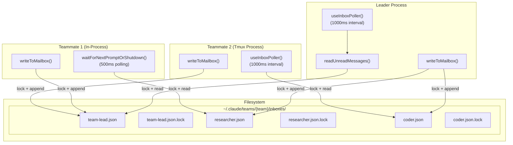
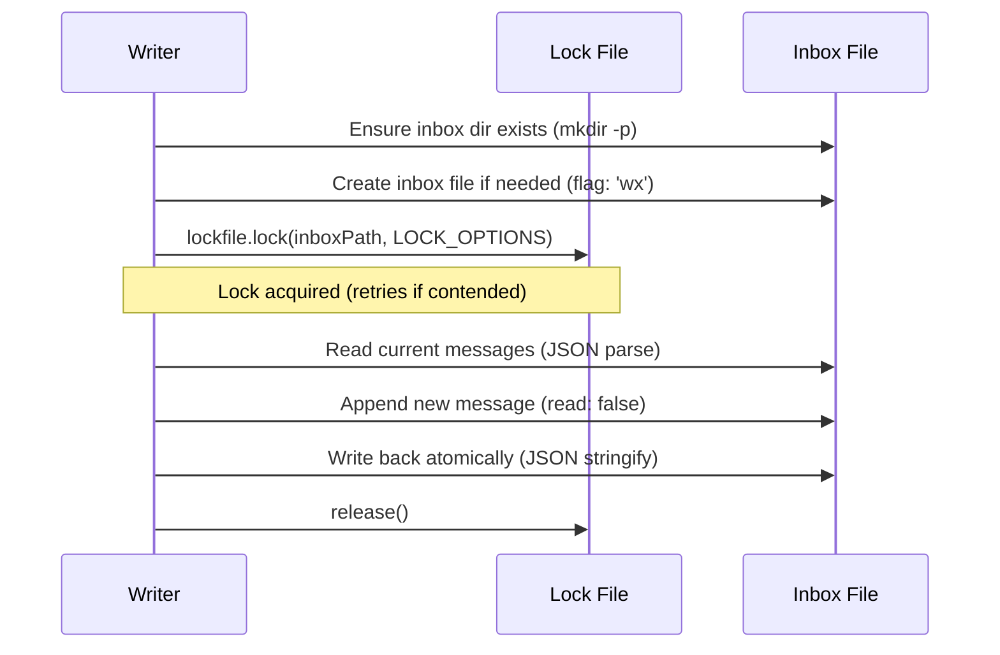
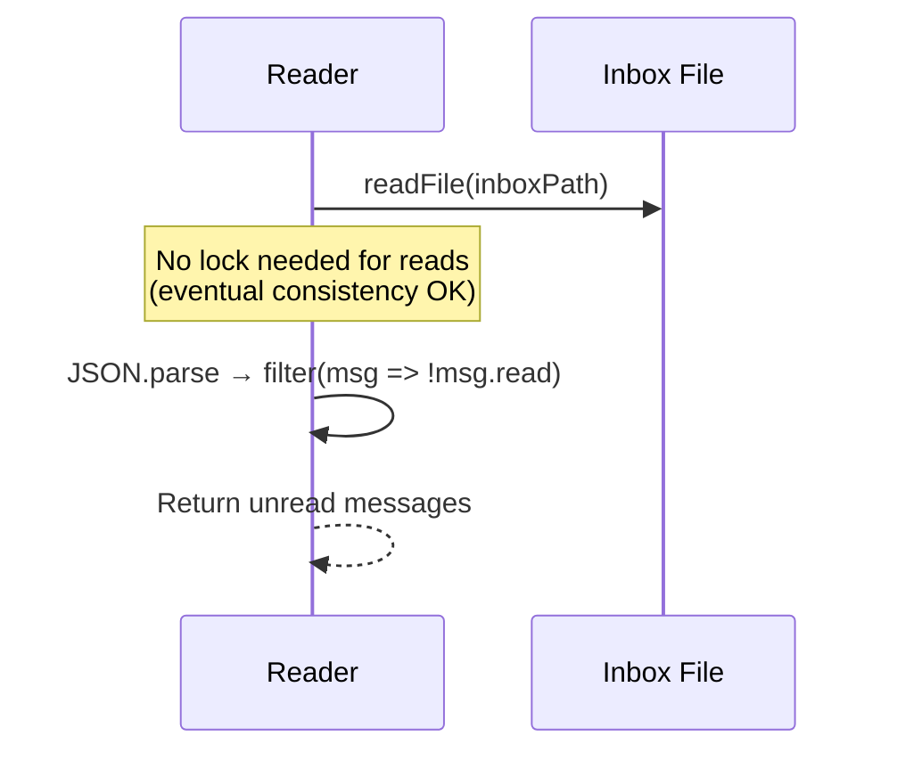
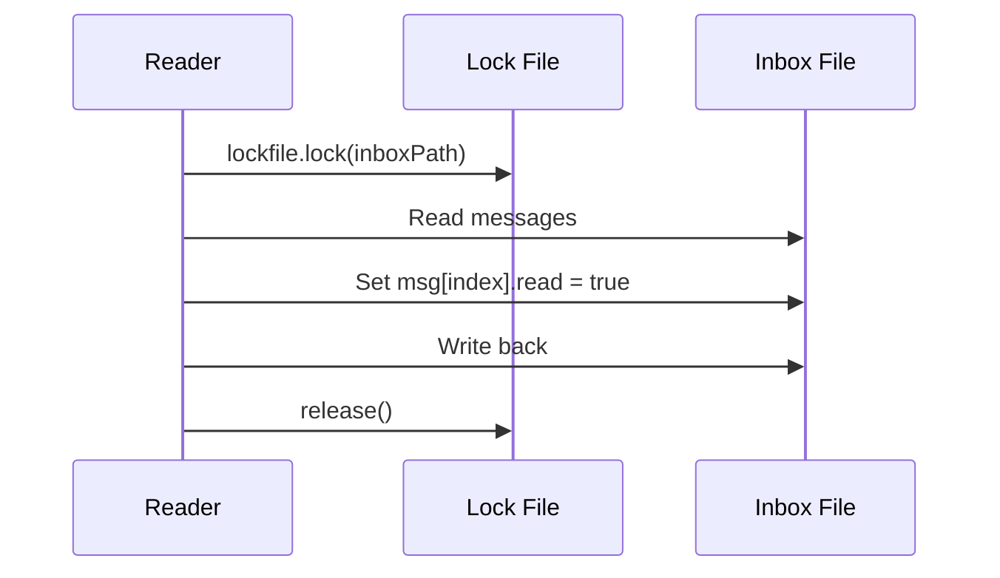
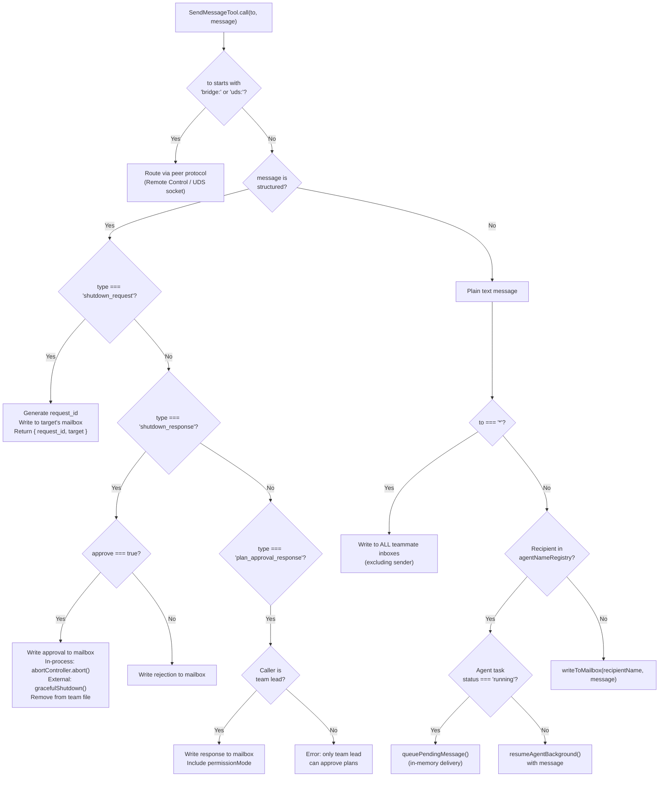
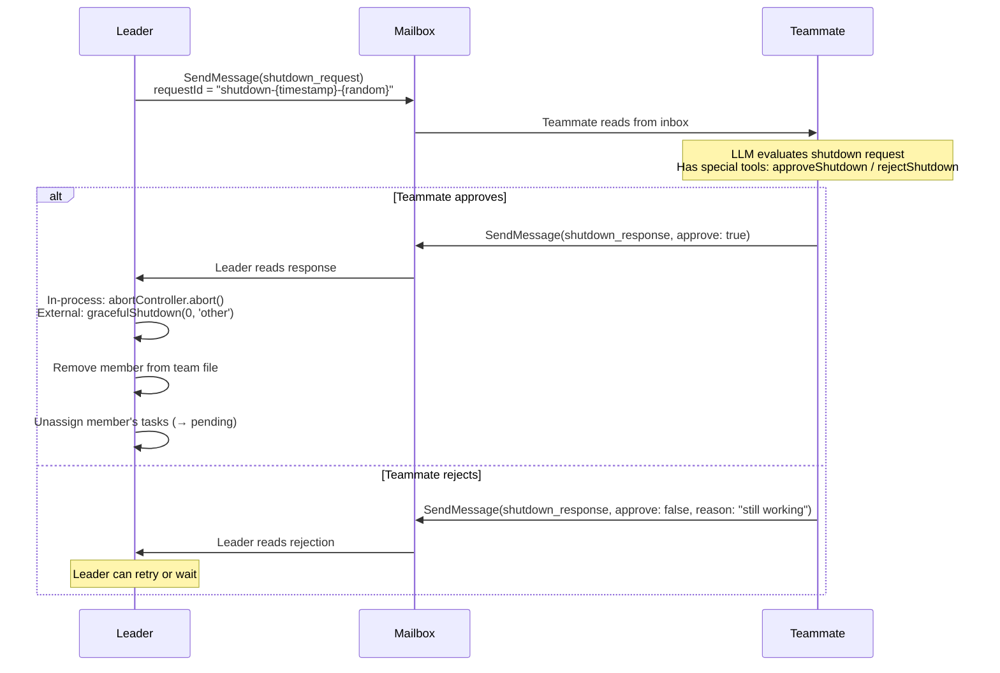
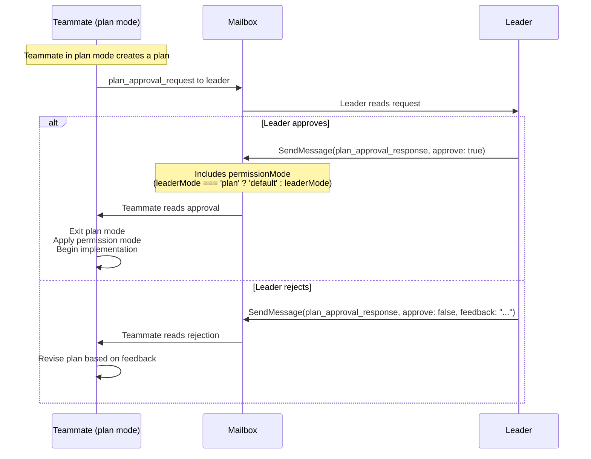
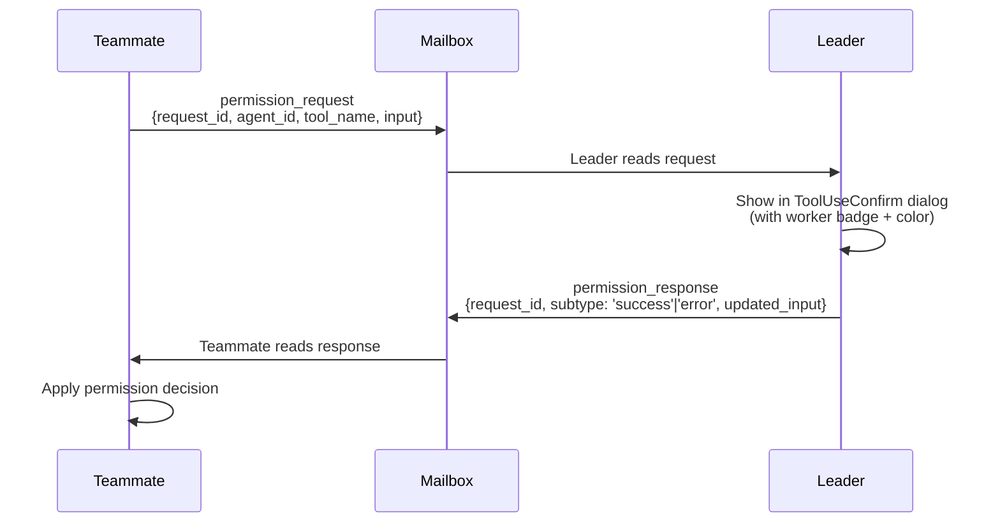
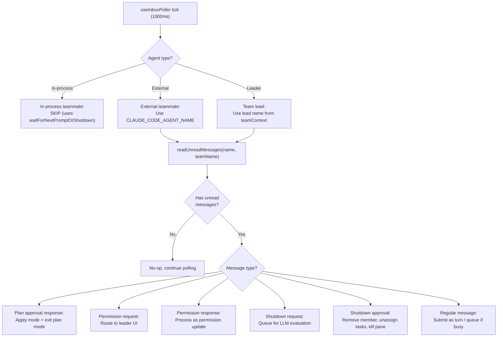

# Communication — Mailbox, SendMessage & Inbox Polling

**Sources**: `src/utils/teammateMailbox.ts`, `src/tools/SendMessageTool/`, `src/hooks/useInboxPoller.ts`

All inter-agent communication flows through a file-based mailbox system. Messages are JSON arrays stored at `~/.claude/teams/{team-name}/inboxes/{agent-name}.json`, protected by `proper-lockfile` for concurrent access.

## Mailbox Architecture



## TeammateMessage Type

```typescript
interface TeammateMessage {
  from: string       // Sender's agent name (e.g., "researcher", "team-lead")
  text: string       // Message body — plain text or JSON-encoded structured message
  timestamp: string  // ISO 8601
  read: boolean      // Read status
  color?: string     // Sender's UI color
  summary?: string   // 5-10 word preview (used by leader for overview)
}
```

## File Locking

All mailbox operations use `proper-lockfile` with retry:

```typescript
const LOCK_OPTIONS = {
  retries: {
    retries: 10,
    minTimeout: 5,    // 5ms initial backoff
    maxTimeout: 100,  // 100ms max backoff
  }
}
```

**Lock file**: `{inboxPath}.lock` (e.g., `researcher.json.lock`)

### Write Operation



### Read Operation



### Mark as Read



## Core Mailbox Functions

| Function | Purpose |
|---|---|
| `readMailbox(agentName, teamName)` | Read all messages (no lock) |
| `readUnreadMessages(agentName, teamName)` | Filter to unread only |
| `writeToMailbox(recipientName, message, teamName)` | Lock → append → unlock |
| `markMessageAsReadByIndex(agentName, teamName, index)` | Lock → mark → unlock |
| `markMessagesAsRead(agentName, teamName)` | Lock → mark all → unlock |
| `clearMailbox(agentName, teamName)` | Delete all messages |
| `formatTeammateMessages(messages)` | Convert to `<teammate-message>` XML for LLM |

## SendMessageTool — Routing Logic

**Source**: `src/tools/SendMessageTool/SendMessageTool.ts`

### Input Schema

```typescript
{
  to: string        // Recipient: name, "*" (broadcast), "uds:/path", "bridge:session_id"
  summary?: string  // 5-10 word preview (required for plain text)
  message: string | StructuredMessage
}
```

### Structured Message Types

```typescript
type StructuredMessage =
  | { type: 'shutdown_request'; reason?: string }
  | { type: 'shutdown_response'; request_id: string; approve: boolean; reason?: string }
  | { type: 'plan_approval_response'; request_id: string; approve: boolean; feedback?: string }
```

### Complete Routing Decision Tree



### In-Process Message Fast Path

When sending a plain text message to a named in-process agent:

1. Look up in `appState.agentNameRegistry` → get agentId
2. Find the `LocalAgentTask` by agentId
3. **If running**: Call `queuePendingMessage()` for immediate in-memory delivery (no mailbox roundtrip)
4. **If stopped**: Call `resumeAgentBackground()` which re-starts the agent with the message injected

If the agent is not in the registry, fall back to file-based mailbox.

### Broadcast

Broadcast (`to: "*"`) writes the message to every teammate's inbox in the team file, **excluding the sender**. Returns a `BroadcastOutput` with the list of recipients.

## Structured Message Protocols

### Shutdown Negotiation



### Plan Approval



### Permission Request/Response



## Inbox Polling

### Leader / Pane-Based Teammates

**Source**: `src/hooks/useInboxPoller.ts`

Polls every **1000ms** via `useInterval()`.



### In-Process Teammates

In-process teammates use a different polling mechanism inside their execution loop (`waitForNextPromptOrShutdown()` in `inProcessRunner.ts`). See [In-Process Runner](IN_PROCESS_RUNNER.md) for details.

### Message Delivery Strategy

- **Not loading** (idle, awaiting input): Submit immediately as a new conversation turn
- **Loading** (currently processing): Queue in `AppState.inbox.messages` with `status: 'pending'`, deliver when turn ends

## Structured Protocol Messages (Routing Table)

These message types are detected by `isPermissionRequest()`, `isShutdownRequest()`, etc. and routed by `useInboxPoller` instead of being passed to the LLM as raw text:

| Type | Direction | Purpose |
|---|---|---|
| `permission_request` | Worker → Leader | Request tool permission approval |
| `permission_response` | Leader → Worker | Grant/deny permission |
| `sandbox_permission_request` | Worker → Leader | Request sandbox network access |
| `sandbox_permission_response` | Leader → Worker | Grant/deny sandbox access |
| `shutdown_request` | Leader → Worker | Request graceful shutdown |
| `shutdown_approved` | Worker → Leader | Approve shutdown |
| `shutdown_rejected` | Worker → Leader | Reject shutdown with reason |
| `team_permission_update` | Leader → All | Broadcast permission update |
| `mode_set_request` | Leader → Worker | Set permission mode |
| `plan_approval_request` | Worker → Leader | Request plan approval |
| `plan_approval_response` | Leader → Worker | Approve/reject plan |
| `idle_notification` | Worker → Leader | Worker finished current task |

## Message Creator/Parser Functions

The mailbox provides symmetric creator and parser functions for each structured message type:

| Creator | Parser |
|---|---|
| `createIdleNotification(agentId, options)` | `isIdleNotification(text)` |
| `createShutdownRequestMessage(params)` | `isShutdownRequest(text)` |
| `createShutdownApprovedMessage(params)` | `isShutdownApproved(text)` |
| `createShutdownRejectedMessage(params)` | `isShutdownRejected(text)` |
| `createPermissionRequestMessage(params)` | `isPermissionRequest(text)` |
| `createPermissionResponseMessage(params)` | `isPermissionResponse(text)` |

Each parser does a `JSON.parse()` + `type` field check, returning the parsed object or `null`.

## Idle Notification

Sent when a teammate finishes its current task and goes idle:

```typescript
{
  type: 'idle_notification'
  from: string
  timestamp: string
  idleReason?: 'available' | 'interrupted' | 'failed'
  summary?: string             // "[to {name}] {summary}" of last SendMessage
  completedTaskId?: string     // Task that was just completed
  completedStatus?: 'resolved' | 'blocked' | 'failed'
  failureReason?: string       // If completedStatus is 'failed'
}
```

The summary includes the last peer DM summary from the teammate's conversation (extracted via `getLastPeerDmSummary()`), giving the leader context without reading the full transcript.
