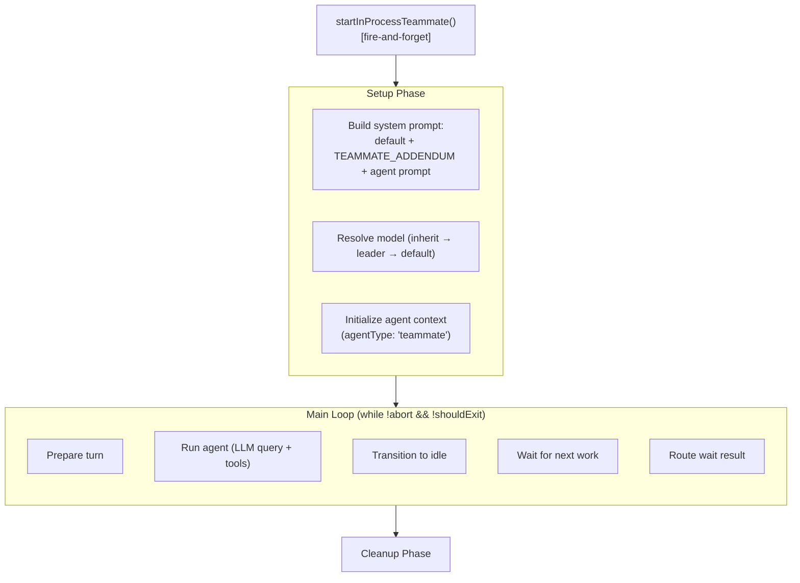
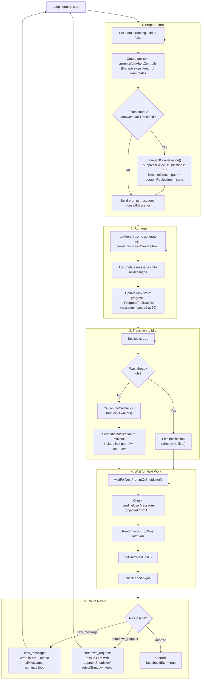
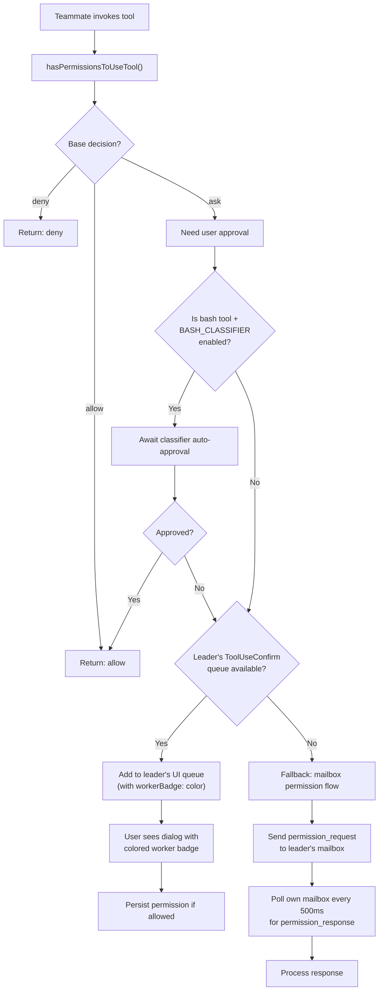
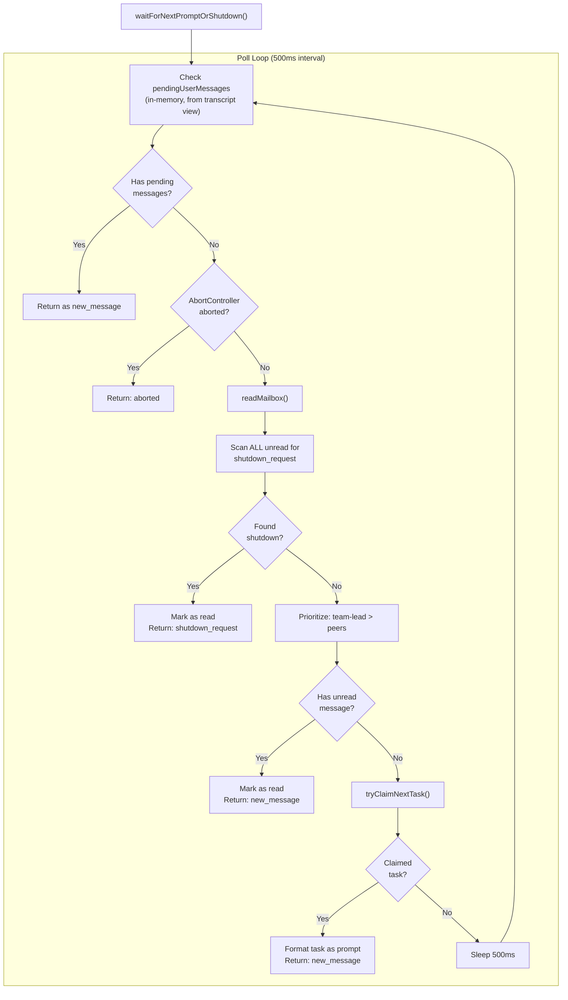
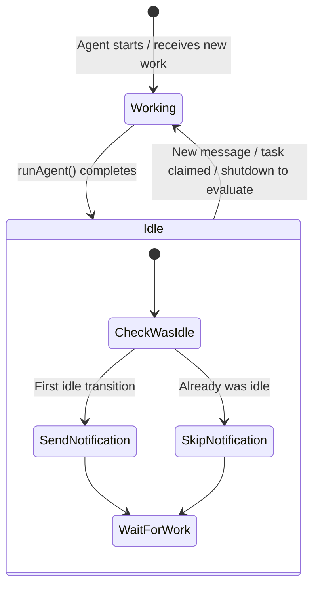
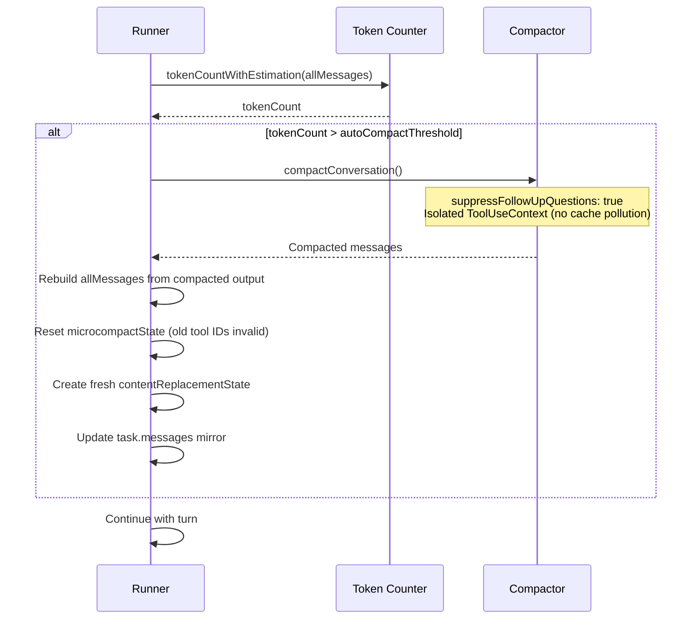
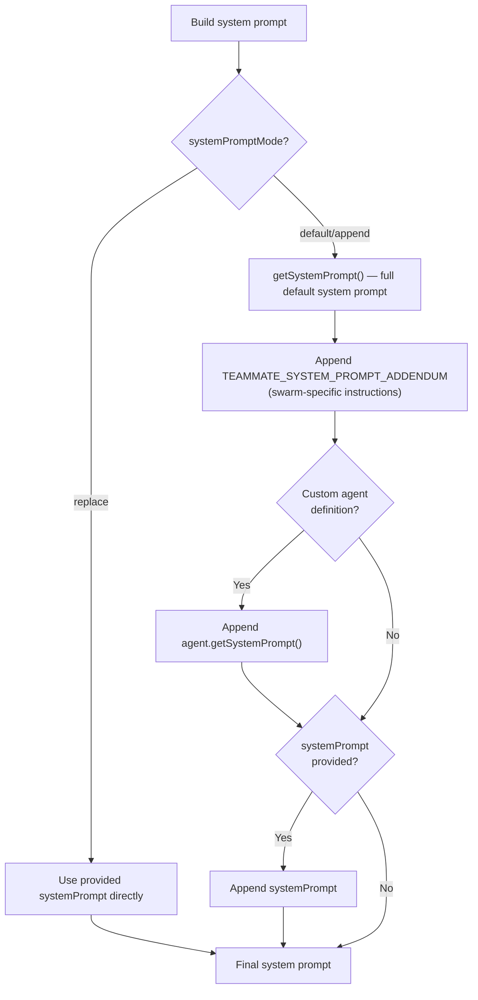
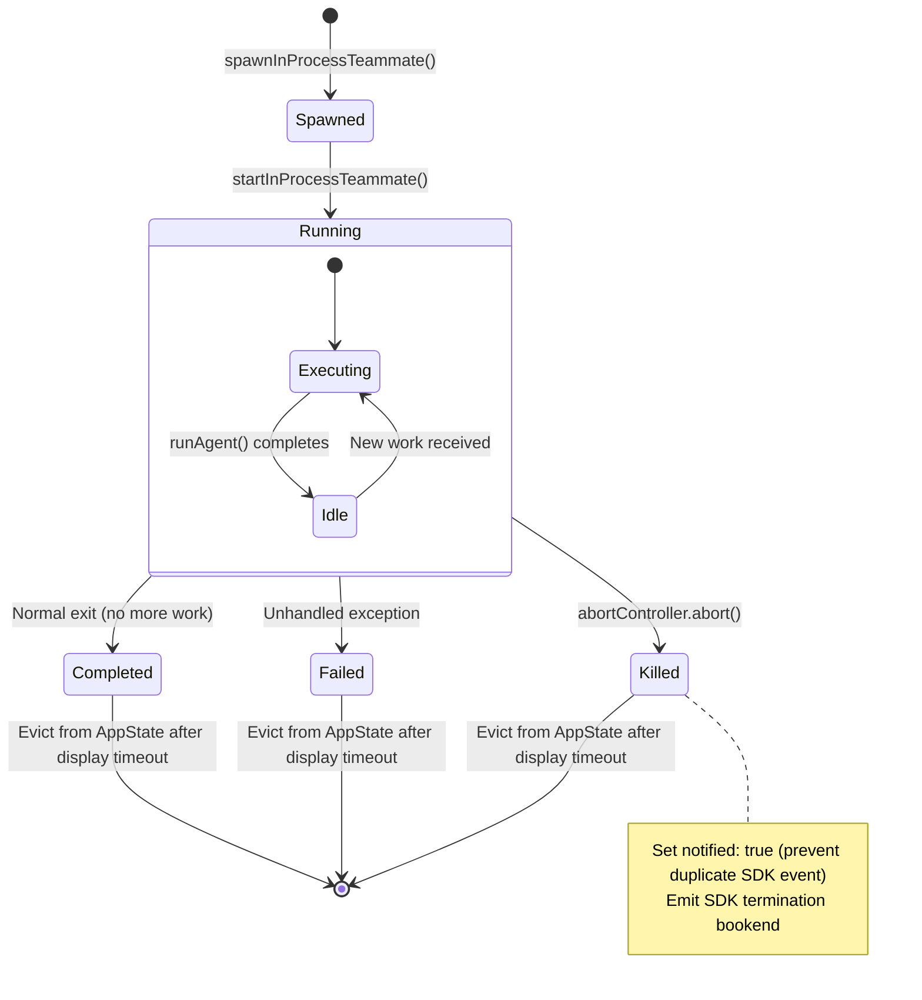

# In-Process Teammate Runner

**Source**: `src/utils/swarm/inProcessRunner.ts` (~1550 lines)

This is the execution engine for in-process teammates. It runs the full agent loop — prompt assembly, LLM queries, tool execution, mailbox polling, task claiming, and idle management — all within the leader's Node.js process, isolated via `AsyncLocalStorage`.

## Execution Overview



## Main Loop Detail



## Permission Bridging

**Function**: `createInProcessCanUseTool()` (lines 127-451)

In-process teammates don't have their own terminal UI. Permission prompts are routed through the leader's `ToolUseConfirm` dialog.



### UI Path (Primary)

1. Get leader's `ToolUseConfirmQueue` via `getLeaderToolUseConfirmQueue()`
2. Add entry with `workerBadge: identity.color` for visual identification
3. Return a `Promise<PermissionDecision>` that resolves when the leader responds
4. On allow: persist permission updates, write back to leader's context
5. On abort: clean up queue entry

### Mailbox Path (Fallback)

1. Create `permission_request` via `createPermissionRequest()`
2. Send to leader's mailbox
3. Register callback via `registerPermissionCallback()`
4. Poll own mailbox every **500ms** for `permission_response`
5. On response: invoke callback with decision
6. Clean up interval and callback on abort or response

### Abort Handling

If the teammate's `AbortController` fires during a permission wait, the function returns `{ behavior: 'ask' }` — effectively blocking the tool execution and allowing the runner to continue to cleanup.

## Mailbox Polling (waitForNextPromptOrShutdown)

When idle, the teammate polls for work from multiple sources:



**Priority order:**
1. In-memory pending messages (from UI injection)
2. Abort signal
3. Shutdown requests (highest priority mailbox message — scans ALL unread)
4. Team lead messages (prioritized over peer messages)
5. Other teammate messages
6. Available tasks from the task list

## Idle Detection & Notification



- `isIdle: true` is set after each `runAgent()` completion
- `onIdleCallbacks[]` are called to unblock `waitForTeammatesToBecomeIdle()`
- Idle notification is sent via mailbox **only on the first idle transition** (checked via `wasAlreadyIdle`)
- Notification includes `getLastPeerDmSummary()` — the summary from the last `SendMessage` call

## Auto-Compaction

Before each turn, the runner checks if the conversation exceeds the token threshold:



After compaction, the conversation is typically 10-20% of the prior token count. The full transcript remains on disk.

## System Prompt Assembly



The `TEAMMATE_SYSTEM_PROMPT_ADDENDUM` adds swarm-specific instructions — how to use `SendMessage`, `TaskList`, `TaskUpdate`, when to go idle, and how to handle shutdown requests.

## Abort / Cancellation

Three levels of abort exist:

```mermaid
flowchart TD
    subgraph Level1["Level 1: Lifecycle Abort (kills teammate)"]
        KillButton["Kill button / killInProcessTeammate()"]
        LifecycleAbort["abortController.abort()"]
        LoopExit["Main loop exits with status: killed"]
    end

    subgraph Level2["Level 2: Work Abort (stops current turn)"]
        EscapeKey["User presses Escape"]
        WorkAbort["currentWorkAbortController.abort()"]
        TurnStops["Current turn stops"]
        AddAbortMsg["Add ERROR_MESSAGE_USER_ABORT to transcript"]
        GoIdle["Teammate goes idle with reason: interrupted"]
        ContinueLoop["Continue main loop"]
    end

    subgraph Level3["Level 3: Permission Abort"]
        PermWait["Waiting for permission"]
        AbortDuringPerm["AbortController fires during wait"]
        ReturnAsk["Return behavior: ask (blocks tool)"]
        ToolBlocked["Tool execution blocked"]
    end

    KillButton --> LifecycleAbort --> LoopExit
    EscapeKey --> WorkAbort --> TurnStops --> AddAbortMsg --> GoIdle --> ContinueLoop
    AbortDuringPerm --> ReturnAsk --> ToolBlocked
```



## AsyncLocalStorage Context

**Source**: `src/utils/teammateContext.ts`, `src/utils/agentContext.ts`

### Why AsyncLocalStorage?

When agents are backgrounded (ctrl+b), multiple agents run concurrently in the same Node.js process. AppState is a single shared mutable object that would be overwritten by concurrent agents. AsyncLocalStorage isolates each async execution chain automatically across `await`/`Promise` chains.

### TeammateContext

```typescript
interface TeammateContext {
  agentId: string              // "researcher@my-team"
  agentName: string            // "researcher"
  teamName: string             // "my-team"
  color?: string               // "blue"
  planModeRequired: boolean
  parentSessionId: string      // Leader's session UUID
  isInProcess: true            // Discriminator
  abortController: AbortController
}
```

### SubagentContext (AgentContext)

```typescript
interface SubagentContext {
  agentId: string
  parentSessionId: string
  subagentName?: string
  isBuiltIn: boolean
  invokingRequestId: string
  invocationKind: 'spawn' | 'continue'
  invocationEmitted: boolean
}
```

### Nesting

The runner wraps execution in both contexts:

```typescript
runWithTeammateContext(teammateCtx, () =>
  runWithAgentContext(agentCtx, () =>
    runAgent(/* ... */)
  )
)
```

Any code anywhere in the call stack can call `getTeammateContext()` or `getAgentContext()` to discover identity without passing it through function parameters.

## State Machine



## Cleanup

After the main loop exits (for any reason):

1. Set final status (`completed` or `failed`) unless already terminal (`killed`)
2. Set `notified: true` (prevents duplicate SDK notification event)
3. Clear messages to last one only (memory optimization)
4. Emit SDK termination bookend via `emitTaskTerminatedSdk()`
5. Evict task from AppState after `STOPPED_DISPLAY_MS` delay (graceful UI removal)
