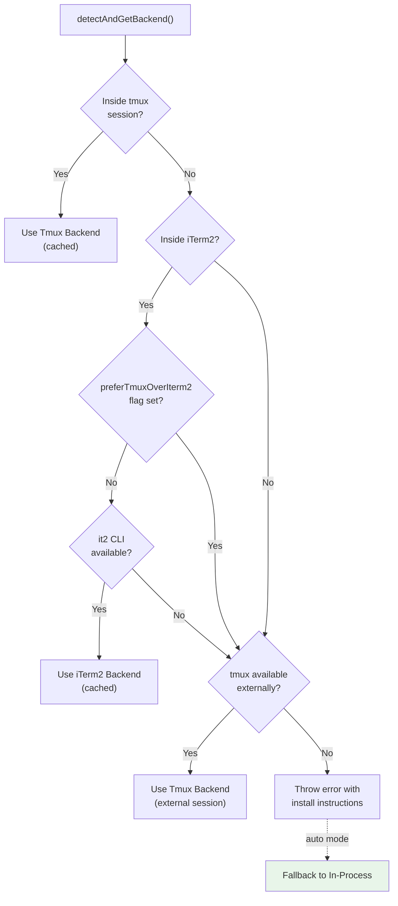
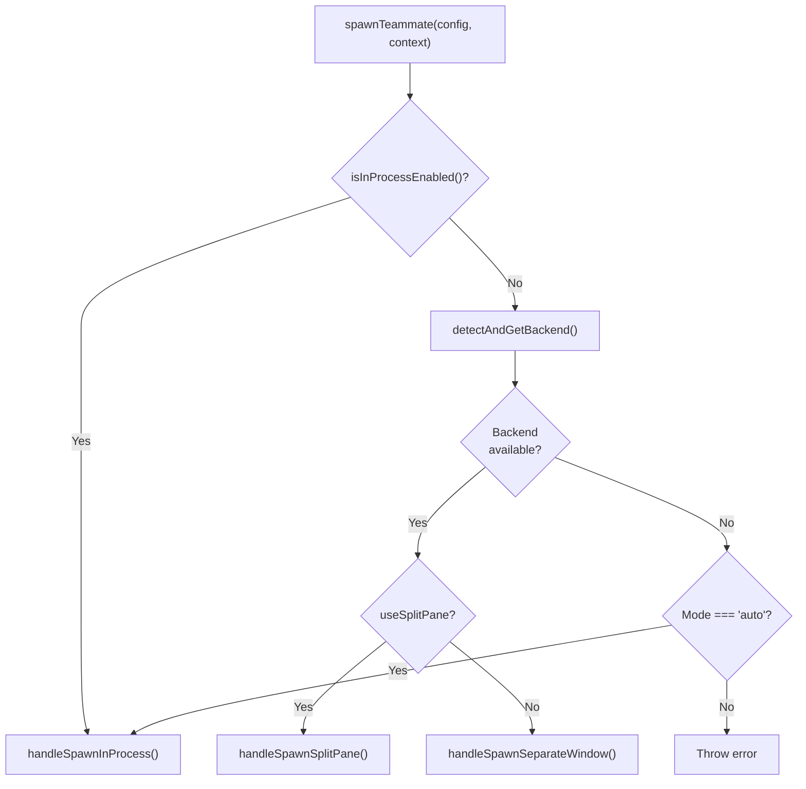
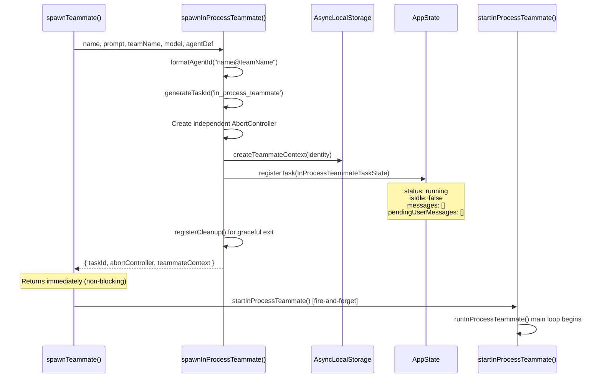
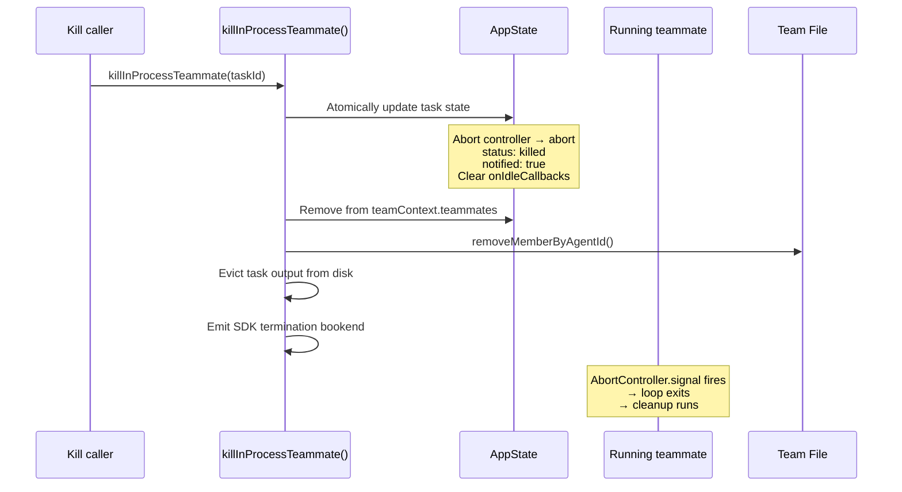
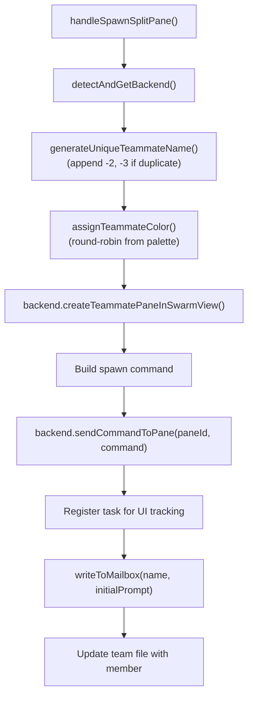

# Spawning & Backends

**Source**: `src/tools/shared/spawnMultiAgent.ts`, `src/utils/swarm/backends/`

Teammate spawning is backend-agnostic. The spawn layer detects the best available execution environment, creates the teammate, registers it in the team file, and hands off execution.

## Backend Detection



Detection result is **cached for the process lifetime** via `cachedDetectionResult`. If no pane backend is available and the mode is `auto`, it falls back to in-process via `markInProcessFallback()`.

## Spawn Decision Flow



## In-Process Spawning

**Source**: `src/utils/swarm/spawnInProcess.ts`

No new process is created. The teammate runs in the same Node.js event loop, isolated via `AsyncLocalStorage`.



### InProcessTeammateTaskState

```typescript
{
  // Identity
  type: 'in_process_teammate'
  identity: TeammateIdentity      // agentId, agentName, teamName, color

  // Execution
  prompt: string                  // Initial task prompt
  model?: string                  // Model override
  selectedAgent?: AgentDefinition // Custom agent definition
  abortController: AbortController // Lifecycle control (kills whole teammate)
  currentWorkAbortController?: AbortController // Per-turn (Escape stops current work)

  // State
  status: 'running' | 'idle' | 'completed' | 'failed' | 'killed'
  isIdle: boolean                 // Separate from status for fine-grained tracking
  shutdownRequested: boolean

  // Messages (UI mirror, capped at 50)
  messages: Message[]
  pendingUserMessages: string[]   // Injected from transcript view
  inProgressToolUseIDs: Set<string> // For animation

  // Lifecycle hooks
  onIdleCallbacks: (() => void)[] // Called when teammate goes idle
  unregisterCleanup?: () => void

  // Metrics
  progress: AgentProgress
  totalPausedMs: number           // Accumulated permission wait time
  lastReportedToolCount: number
  lastReportedTokenCount: number
}
```

### Message Capping

Messages in the task state are capped at **50 items** (`TEAMMATE_MESSAGES_UI_CAP`). Analysis showed 20-125MB per agent at 500+ turns. The full conversation is preserved in `allMessages` (in-memory for the runner) and on the disk transcript.

### Kill Flow



## Pane-Based Spawning (Tmux / iTerm2)

Each teammate is a **new Bun process** running the same executable with different CLI arguments.

### Spawn Command Construction



### CLI Flag Inheritance (`buildInheritedCliFlags()`)

The spawned process inherits critical flags from the leader:

| Flag | When |
|---|---|
| `--dangerously-skip-permissions` | Unless plan mode required |
| `--permission-mode acceptEdits` or `auto` | When leader uses these modes |
| `--model <override>` | When model explicitly overridden |
| `--settings <path>` | When custom settings path used |
| `--plugin-dir <path>` | For each inline plugin directory |
| `--chrome` / `--no-chrome` | Browser availability overrides |

### Environment Variable Propagation (`buildInheritedEnvVars()`)

| Variable | Purpose |
|---|---|
| `CLAUDECODE=1` | Always set |
| `CLAUDE_CODE_EXPERIMENTAL_AGENT_TEAMS=1` | Always set |
| `CLAUDE_CODE_USE_BEDROCK` / `_VERTEX` / `_FOUNDRY` | API provider |
| `ANTHROPIC_BASE_URL` | Custom API endpoint |
| `CLAUDE_CONFIG_DIR` | Config directory override |
| `CLAUDE_CODE_REMOTE` / `_REMOTE_MEMORY_DIR` | Remote session info |
| `HTTPS_PROXY`, `HTTP_PROXY`, `NO_PROXY` | Proxy configuration |
| `SSL_CERT_FILE`, `NODE_EXTRA_CA_CERTS` | Certificate overrides |

### Teammate-Specific CLI Arguments

```
--agent-id <name@team>
--agent-name <name>
--team-name <team>
--agent-color <color>
--parent-session-id <uuid>
--plan-mode-required (when applicable)
```

### Tmux Session Management

**Inside tmux**: Split the current window (leader gets 30%, teammates get 70% with `main-vertical` layout)

**Outside tmux**: Create external session `claude-swarm-{PID}` with a dedicated socket name

**Pane creation serialization**: Uses a promise-chain lock (`acquirePaneCreationLock()`) to prevent race conditions when spawning multiple teammates in parallel. A 200ms shell init delay is added after pane creation for rc files to load.

### Tmux Pane Operations

| Operation | Command |
|---|---|
| Send command | `tmux send-keys -t {pane} {command} Enter` |
| Set border color | `tmux set pane-border-style fg={color}` |
| Set title | `tmux set pane-title ...` + `pane-border-format ...` |
| Kill pane | `tmux kill-pane -t {pane}` |
| Hide pane | `tmux break-pane` to hidden session |
| Show pane | `tmux join-pane` back to window |

## Unique Name Generation

```typescript
async function generateUniqueTeammateName(baseName: string, teamName?: string): Promise<string> {
  // Read team file to check existing member names
  // If baseName already exists: try baseName-2, baseName-3, etc.
  // Return first unique name
}
```

## Process Lifecycle Comparison

| Aspect | In-Process | Pane-Based (Tmux/iTerm2) |
|---|---|---|
| **Process** | Same Node.js process | New Bun process |
| **Isolation** | AsyncLocalStorage | Separate process memory |
| **Communication** | Shared AppState + file mailbox | File mailbox only |
| **Identity** | TeammateContext in ALS | CLI args + env vars |
| **Permission prompts** | Route through leader UI | Mailbox-based permission flow |
| **Abort** | AbortController.abort() | tmux kill-pane / process signal |
| **Startup time** | Near-instant | Process init + shell RC (~200ms+) |
| **Memory** | Shared heap (capped messages) | Separate heap per process |
| **Resource cleanup** | In-process callbacks | Process exit + team file cleanup |
