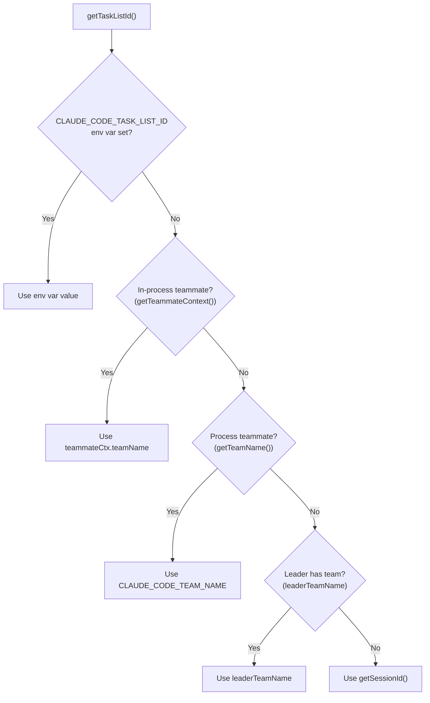
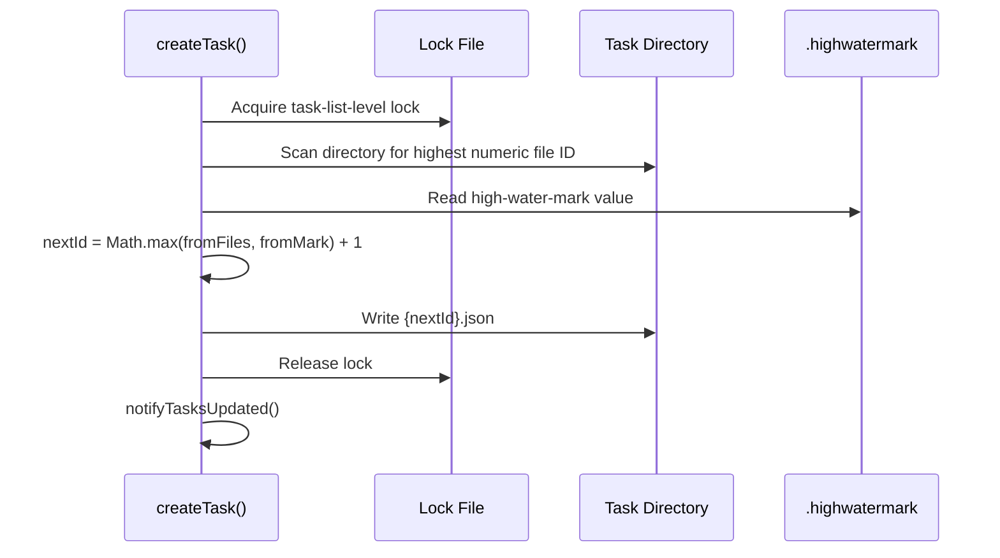
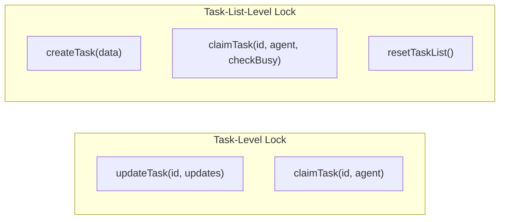
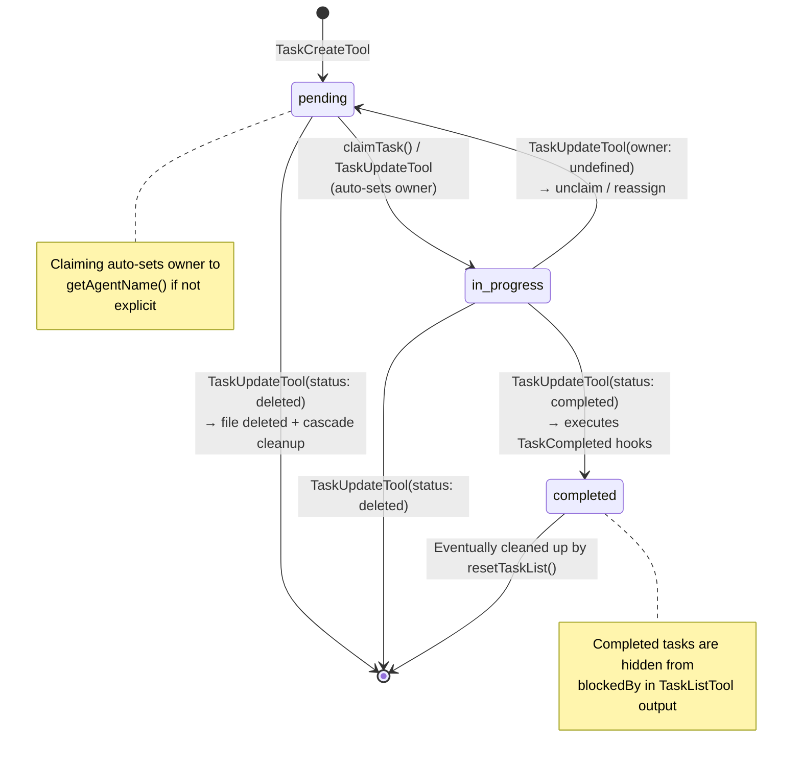
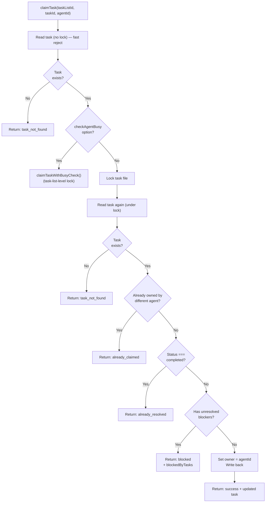
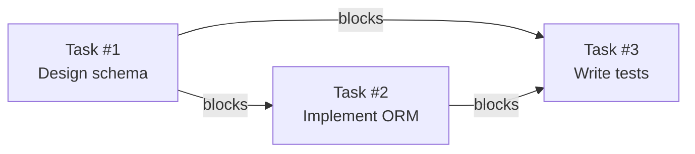
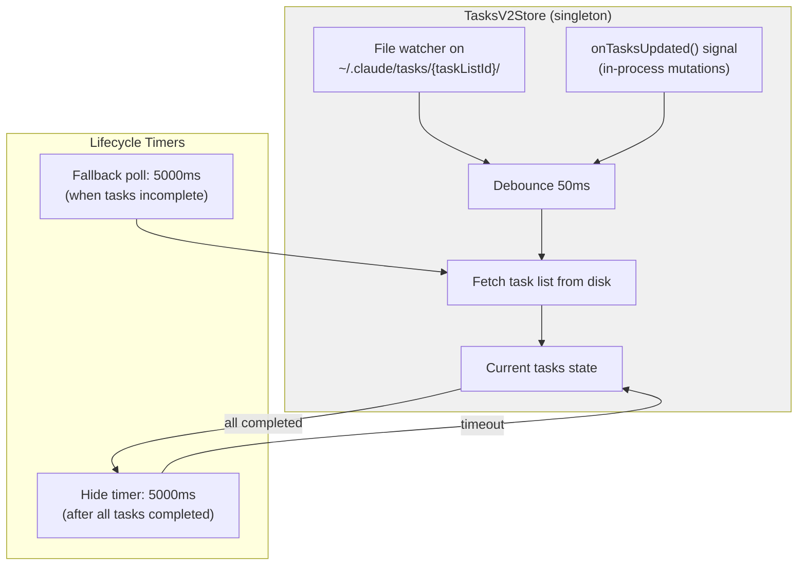
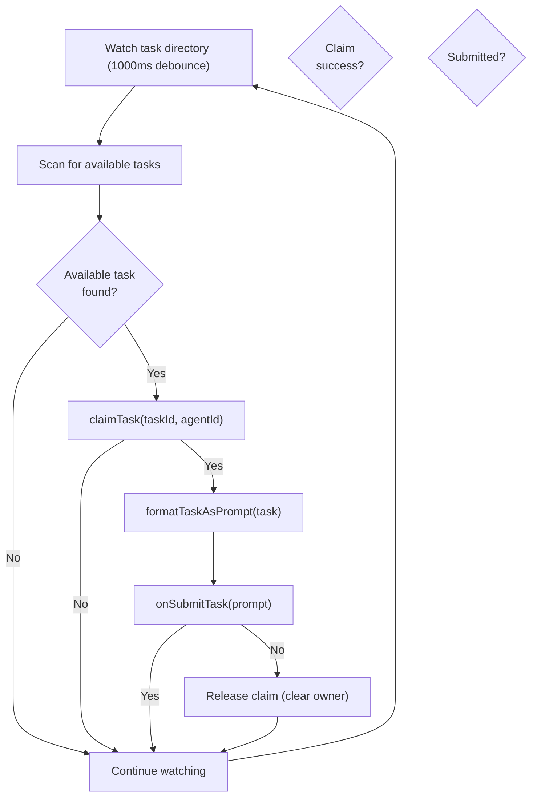
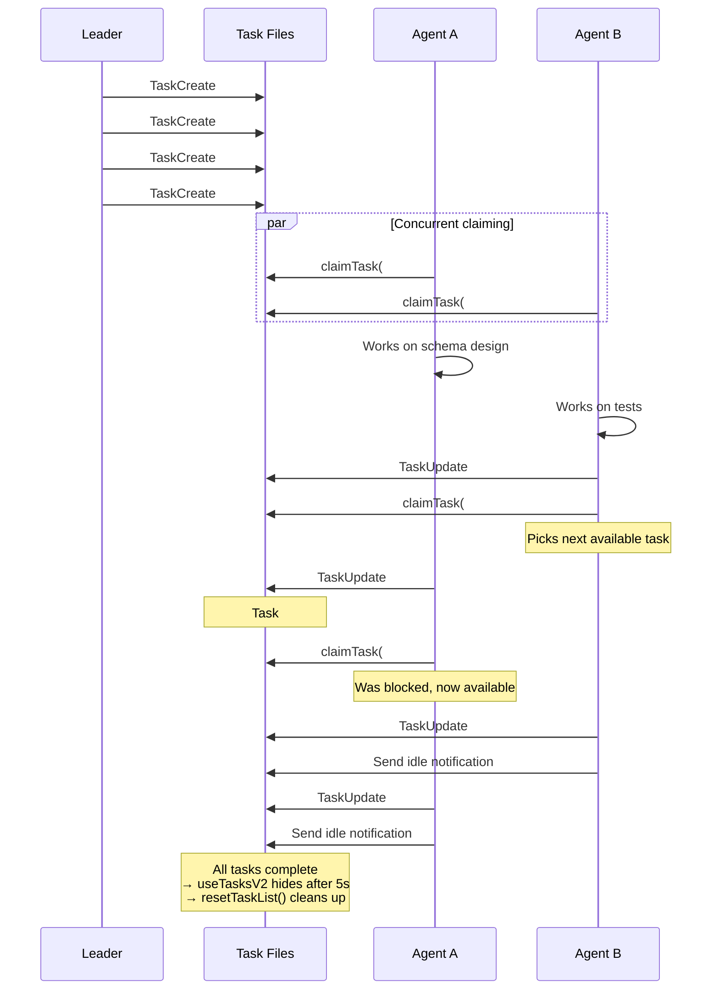

# Task System

**Sources**: `src/utils/tasks.ts`, `src/tools/Task{Create,Update,Get,List,Stop}Tool/`, `src/hooks/useTasksV2.ts`, `src/hooks/useTaskListWatcher.ts`

Tasks are the primary coordination primitive for multi-agent work. They live as individual JSON files on disk with file-level locking for concurrent safety.

## Task Data Model

```typescript
const TASK_STATUSES = ['pending', 'in_progress', 'completed'] as const
type TaskStatus = 'pending' | 'in_progress' | 'completed'

interface Task {
  id: string                          // Numeric string ("1", "2", "3")
  subject: string                     // Brief actionable title
  description: string                 // Detailed requirements
  activeForm?: string                 // Present continuous for spinner ("Running tests")
  owner?: string                      // Agent name or ID that claimed this task
  status: TaskStatus                  // pending | in_progress | completed
  blocks: string[]                    // Task IDs this task blocks (downstream)
  blockedBy: string[]                 // Task IDs that block this task (upstream)
  metadata?: Record<string, unknown>  // Arbitrary metadata
}
```

**Reserved metadata keys:**
- `_internal`: When truthy, task is hidden from `TaskListTool` output (used for system tasks)

## Storage Layout

```
~/.claude/tasks/{taskListId}/
├── .lock                   # Task list level lock (for ID generation, busy checks)
├── .highwatermark          # Maximum task ID ever assigned (prevents reuse)
├── 1.json                  # Task file (pretty-printed JSON, 2-space indent)
├── 2.json
├── 3.json
└── ...
```

Each task is an individual JSON file. No transaction log — atomicity comes from file locking.

## Task List Resolution

The `taskListId` determines which directory tasks are stored in. It follows a priority chain:



This means all teammates in a team share the same task directory (keyed by team name), enabling shared coordination.

## High-Water-Mark ID Generation

Task IDs are never reused, even after deletion or team reset. This prevents confusion when agents reference tasks by ID.



### Why High-Water-Mark?

When a team is reset (`resetTaskList()`), all task JSON files are deleted but the `.highwatermark` is updated first:

```typescript
async function resetTaskList(taskListId: string): Promise<void> {
  // Acquire lock
  const currentHighest = await findHighestTaskIdFromFiles(taskListId)
  if (currentHighest > 0) {
    const existingMark = await readHighWaterMark(taskListId)
    if (currentHighest > existingMark) {
      await writeHighWaterMark(taskListId, currentHighest)
    }
  }
  // Delete all .json files (keep .lock, .highwatermark)
  // Release lock, notify
}
```

After reset, the next team's tasks start from `previousMax + 1`.

## File Locking

```typescript
const LOCK_OPTIONS = {
  retries: {
    retries: 30,        // Supports ~10+ concurrent agents
    minTimeout: 5,      // 5ms initial backoff
    maxTimeout: 100,    // 100ms max backoff
  }
  // Total budget: ~2.6 seconds worst case
}
```

### Two Lock Scopes

| Scope | Lock File | Used For |
|---|---|---|
| **Task-level** | `{taskId}.json` (the task file itself) | Single task mutations (update, claim without busy check) |
| **Task-list-level** | `.lock` | Atomic multi-task operations (ID generation, busy check claims) |



## Task Lifecycle



## Task Claiming

### Basic Claim (Task-Level Lock)



### Claim with Busy Check (Task-List-Level Lock)

When `checkAgentBusy: true`, the system acquires a **list-level lock** and checks whether the agent already owns other open tasks:

```typescript
// Inside claimTaskWithBusyCheck() — under task-list-level lock
const allTasks = await listTasks(taskListId)

const agentOpenTasks = allTasks.filter(t =>
  t.status !== 'completed' &&
  t.owner === claimantAgentId &&
  t.id !== taskId
)

if (agentOpenTasks.length > 0) {
  return { success: false, reason: 'agent_busy', busyWithTasks: agentOpenTasks.map(t => t.id) }
}
```

### Claim Result Type

```typescript
interface ClaimTaskResult {
  success: boolean
  reason?: 'task_not_found' | 'already_claimed' | 'already_resolved' | 'blocked' | 'agent_busy'
  task?: Task
  busyWithTasks?: string[]    // When reason is 'agent_busy'
  blockedByTasks?: string[]   // When reason is 'blocked'
}
```

## Dependency Management



### Establishing Dependencies

```typescript
async function blockTask(taskListId, fromTaskId, toTaskId): Promise<boolean> {
  // fromTask.blocks.push(toTaskId)  — bidirectional update
  // toTask.blockedBy.push(fromTaskId)
}
```

Called by `TaskUpdateTool` when `addBlocks` or `addBlockedBy` parameters are provided.

### Dependency Resolution

When listing tasks (`TaskListTool`), `blockedBy` is filtered to **only show unresolved blockers**:

```typescript
// Completed task IDs
const completedIds = new Set(tasks.filter(t => t.status === 'completed').map(t => t.id))

// For each task, filter blockedBy to unresolved only
task.blockedBy.filter(id => !completedIds.has(id))
```

When claiming a task, unresolved blockers prevent the claim:

```typescript
const unresolvedTaskIds = new Set(allTasks.filter(t => t.status !== 'completed').map(t => t.id))
const blockedByTasks = task.blockedBy.filter(id => unresolvedTaskIds.has(id))
if (blockedByTasks.length > 0) return { success: false, reason: 'blocked' }
```

### Cascade Cleanup on Delete

When a task is deleted, its references are removed from all other tasks:

```typescript
async function deleteTask(taskListId, taskId): Promise<boolean> {
  // Update high-water mark BEFORE deletion
  // Delete the file
  // Cascade: remove taskId from all other tasks' blocks/blockedBy arrays
}
```

## Task Tools

### TaskCreateTool

```typescript
// Input
{ subject: string, description: string, activeForm?: string, metadata?: object }

// Process
1. createTask(getTaskListId(), { ...input, status: 'pending', owner: undefined, blocks: [], blockedBy: [] })
2. executeTaskCreatedHooks(taskId, subject, description, agentName, teamName)
3. If hook returns blockingError → deleteTask() (rollback) + throw Error
4. Auto-expand task list in UI

// Output
{ task: { id: string, subject: string } }
```

### TaskUpdateTool

```typescript
// Input
{
  taskId: string,
  subject?: string, description?: string, activeForm?: string,
  status?: 'pending' | 'in_progress' | 'completed' | 'deleted',
  owner?: string,
  addBlocks?: string[], addBlockedBy?: string[],
  metadata?: object
}

// Special behaviors
- status: 'deleted' → permanently deletes task file
- status: 'completed' → executes TaskCompleted hooks BEFORE updating
  - If hook returns blockingError → return error (don't complete)
- status: 'in_progress' → auto-sets owner to getAgentName() if not explicitly set
- owner change → sends task_assignment notification to new owner via mailbox
- After completion → teammate gets reminder:
  "Call TaskList now to find your next available task"
```

### TaskGetTool

```typescript
// Input:  { taskId: string }
// Output: { task: Task | null }
// Read-only, returns full task details
```

### TaskListTool

```typescript
// Input: {} (no parameters)
// Output: { tasks: Task[] }
// Filtering:
//   - Excludes tasks with metadata._internal
//   - Filters blockedBy to only unresolved dependencies
```

### TaskStopTool

Stops **background execution tasks** (LocalShellTask, LocalAgentTask), NOT work tasks. Validates the task exists and is in `'running'` state.

## Task Hooks

**Source**: `src/utils/hooks.ts`

### TaskCreated Hook

Executed after task creation, before returning to caller:

```typescript
interface TaskCreatedHookInput {
  hook_event_name: 'TaskCreated'
  task_id: string
  task_subject: string
  task_description?: string
  teammate_name?: string
  team_name?: string
}
```

If a hook script exits with code 2, it returns a `blockingError`. The task is then rolled back (deleted) and an error thrown.

### TaskCompleted Hook

Executed before marking a task as completed:

```typescript
interface TaskCompletedHookInput {
  hook_event_name: 'TaskCompleted'
  task_id: string
  task_subject: string
  task_description?: string
  teammate_name?: string
  team_name?: string
}
```

If a hook returns a blocking error, the completion is prevented and the error returned to the LLM.

## Task Notification System

In-process subscribers are notified of mutations via a signal pattern:

```typescript
const tasksUpdated = createSignal()

// Subscribe
const unsubscribe = tasksUpdated.subscribe(() => { /* re-fetch */ })

// Emit (called after every mutation)
function notifyTasksUpdated(): void {
  tasksUpdated.emit()
}
```

Notifications fire after: `createTask`, `updateTask`, `deleteTask`, `blockTask`, `setLeaderTeamName`, `clearLeaderTeamName`, `resetTaskList`.

## UI Display

### useTasksV2 Hook

**Source**: `src/hooks/useTasksV2.ts`

Singleton task list store with file watching:



- **Debounce**: 50ms after file change or signal
- **Fallback poll**: 5000ms when any tasks are incomplete (in case file watcher misses events)
- **Hide delay**: 5000ms after all tasks complete → tasks disappear from UI
- **Reset**: When hidden, calls `resetTaskList()` to clean up files

### useTaskListWatcher Hook

**Source**: `src/hooks/useTaskListWatcher.ts`

Used in "tasks mode" where Claude watches a task list and auto-claims work:



Available task criteria:
- `status: 'pending'`
- `owner: undefined`
- All `blockedBy` tasks are completed

## Task Unassignment on Teammate Exit

When a teammate exits (shutdown or killed), their tasks are released:

```typescript
async function unassignTeammateTasks(teamName, teammateId, teammateName, reason) {
  // Find tasks where:
  //   status !== 'completed' AND (owner === teammateId OR owner === teammateName)
  // For each: updateTask({ owner: undefined, status: 'pending' })
  // Return notification message with count and list
}
```

## Agent Status Tracking

```typescript
interface AgentStatus {
  agentId: string
  name: string
  agentType?: string
  status: 'idle' | 'busy'      // idle if no open tasks, busy if owns any
  currentTasks: string[]        // Task IDs agent owns
}

async function getAgentStatuses(teamName: string): Promise<AgentStatus[] | null> {
  // Read team file → get all members
  // For each member: find tasks with owner matching
  // Return idle/busy status
}
```

## Complete Task Coordination Example


