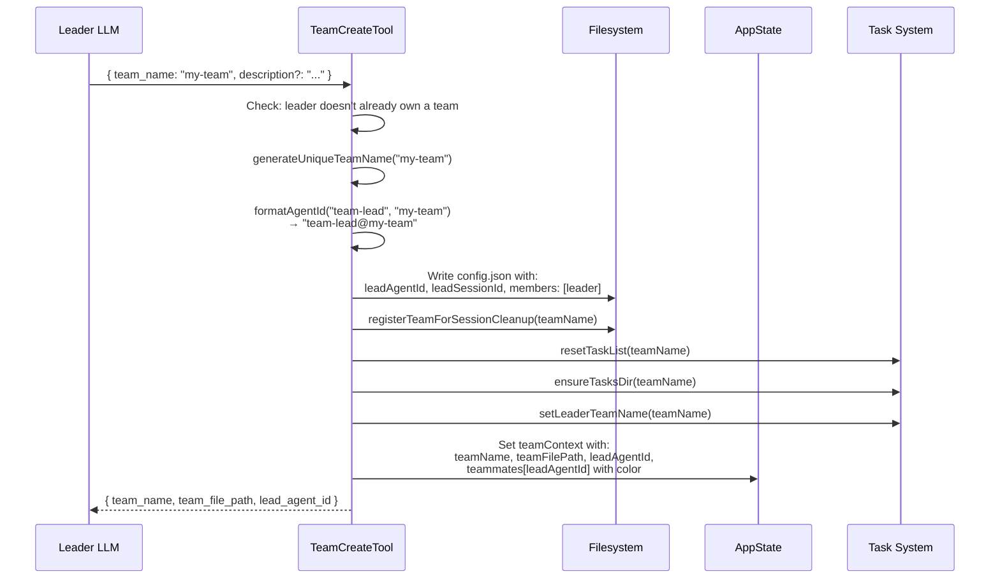
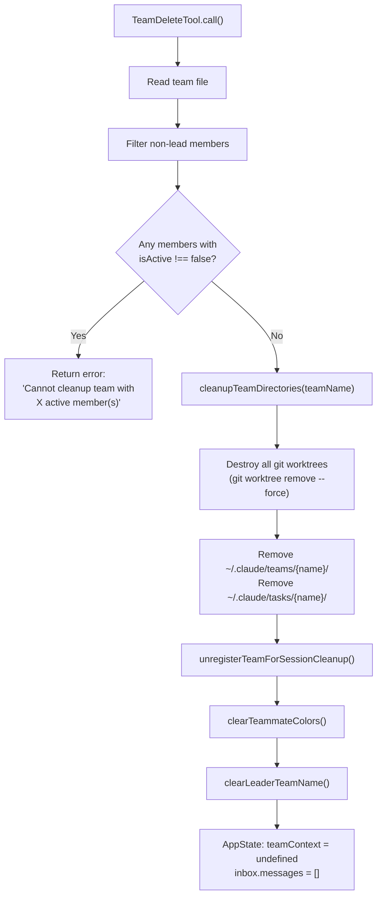
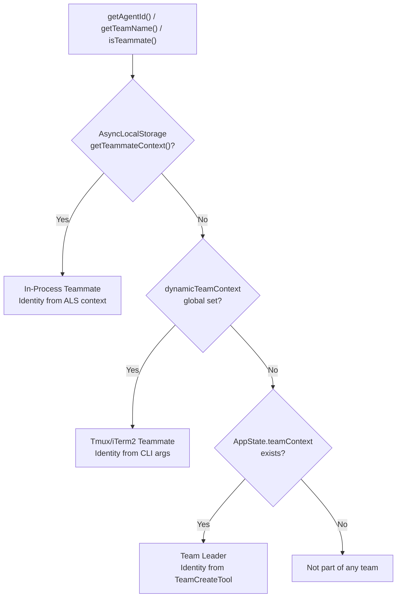
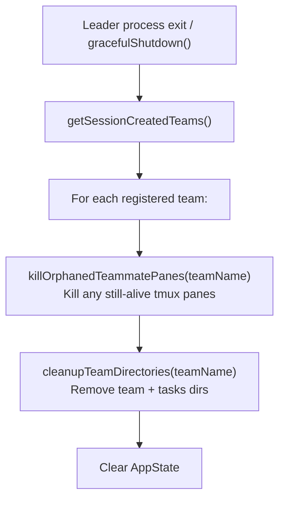

# Teams & Coordinator Mode

**Sources**: `src/tools/TeamCreateTool/`, `src/tools/TeamDeleteTool/`, `src/coordinator/coordinatorMode.ts`, `src/utils/swarm/teamHelpers.ts`

Teams are the top-level organizational primitive for multi-agent coordination. A team consists of a leader agent and zero or more teammate agents that share a task list and communicate via mailbox.

## Team File Structure

**Location**: `~/.claude/teams/{team-name}/config.json`

```typescript
interface TeamFile {
  name: string                     // Team identifier
  description?: string             // Human-readable description
  createdAt: number                // Unix timestamp
  leadAgentId: string              // Deterministic: "team-lead@{teamName}"
  leadSessionId?: string           // Leader's actual session UUID (for discovery)
  hiddenPaneIds?: string[]         // Tmux panes currently hidden from UI
  teamAllowedPaths?: TeamAllowedPath[]  // Paths all teammates can edit without asking

  members: Array<{
    agentId: string                // "researcher@my-team"
    name: string                   // "researcher"
    agentType?: string             // Custom agent type (e.g., "code-reviewer")
    model?: string                 // Model override
    prompt?: string                // Initial prompt
    color?: string                 // Assigned UI color
    planModeRequired?: boolean     // Must get plan approval before implementing
    joinedAt: number               // Unix timestamp
    tmuxPaneId: string             // Pane ID (or 'in-process')
    cwd: string                    // Working directory
    worktreePath?: string          // Git worktree path if isolated
    sessionId?: string             // Teammate's session UUID
    subscriptions: string[]        // Subscribed tools/events
    backendType?: 'tmux' | 'iterm2' | 'in-process'
    isActive?: boolean             // false when idle, undefined/true when active
    mode?: PermissionMode          // Current permission mode
  }>
}

interface TeamAllowedPath {
  path: string
  toolName: string
  addedBy: string
  addedAt: number
}
```

## Filesystem Layout

```
~/.claude/
├── teams/{team-name}/
│   ├── config.json                    # TeamFile
│   ├── inboxes/
│   │   ├── team-lead.json             # Leader's inbox
│   │   ├── researcher.json            # Teammate inbox
│   │   ├── researcher.json.lock       # File lock
│   │   ├── coder.json
│   │   └── coder.json.lock
│   └── permissions/                   # Legacy permission sync
│       ├── pending/
│       └── resolved/
└── tasks/{team-name}/
    ├── .lock                          # Task list lock
    ├── .highwatermark                 # Max task ID ever assigned
    ├── 1.json                         # Task files
    ├── 2.json
    └── 3.json
```

## Team Creation

**Source**: `src/tools/TeamCreateTool/TeamCreateTool.ts`



**Key constraint**: A leader can only own **one team at a time**. Attempting to create a second team returns an error.

**Leader's agentId is deterministic**: `team-lead@{teamName}` — computed via `formatAgentId(TEAM_LEAD_NAME, teamName)`. No environment variable is set for the leader (it's not a "teammate" in the environment variable sense).

## Team Deletion

**Source**: `src/tools/TeamDeleteTool/TeamDeleteTool.ts`



**Safety check**: Cannot delete a team with active members. Teammates must be shut down first (via `SendMessage` shutdown request → teammate approves → member removed from team file).

## AppState Team Context

**Source**: `src/state/AppStateStore.ts`

```typescript
// AppState shape for team coordination
{
  teamContext?: {
    teamName: string
    teamFilePath: string
    leadAgentId: string
    selfAgentId?: string       // Swarm member's own ID (=leadAgentId for leaders)
    selfAgentName?: string     // 'team-lead' for leaders
    isLeader?: boolean
    selfAgentColor?: string    // Color for dynamically joined sessions
    teammates: {
      [teammateId: string]: {
        name: string
        agentType?: string
        color?: string
        tmuxSessionName: string
        tmuxPaneId: string
        cwd: string
        worktreePath?: string
        spawnedAt: number
      }
    }
  }

  inbox: {
    messages: Array<{
      id: string
      from: string
      text: string
      timestamp: string
      status: 'pending' | 'processing' | 'processed'
      color?: string
      summary?: string
    }>
  }

  agentNameRegistry: Map<string, string>  // name → agentId (for SendMessage routing)
}
```

## Team Helpers

**Source**: `src/utils/swarm/teamHelpers.ts`

### File I/O
| Function | Purpose | Sync/Async |
|---|---|---|
| `readTeamFile(teamName)` | Read config.json | Sync (for React render) |
| `readTeamFileAsync(teamName)` | Read config.json | Async (for tool handlers) |
| `writeTeamFileAsync(teamName, teamFile)` | Write config.json (with mkdir) | Async |

### Member Management
| Function | Purpose |
|---|---|
| `removeTeammateFromTeamFile(teamName, {agentId \| name})` | Remove by ID or name |
| `removeMemberFromTeam(teamName, tmuxPaneId)` | Remove by pane ID (external teammates) |
| `removeMemberByAgentId(teamName, agentId)` | Remove in-process teammate |
| `setMemberMode(teamName, memberName, mode)` | Set permission mode for one member |
| `setMultipleMemberModes(teamName, modeUpdates)` | Atomic multi-member mode update |
| `setMemberActive(teamName, memberName, isActive)` | Set idle/active flag |
| `syncTeammateMode(mode, teamNameOverride?)` | Teammate syncs own mode to file |

### Cleanup
| Function | Purpose |
|---|---|
| `cleanupTeamDirectories(teamName)` | Remove team + tasks dirs, destroy worktrees |
| `killOrphanedTeammatePanes(teamName)` | Kill pane-backed teammates on ungraceful exit |
| `destroyWorktree(worktreePath)` | `git worktree remove --force`, fallback `rm -rf` |
| `registerTeamForSessionCleanup(teamName)` | Track team for exit cleanup |
| `unregisterTeamForSessionCleanup(teamName)` | Remove from cleanup tracking |

### Name Utilities
| Function | Purpose |
|---|---|
| `sanitizeName(name)` | Replace non-alphanumeric with hyphens, lowercase |
| `sanitizeAgentName(name)` | Replace `@` with `-` (for agent IDs in file paths) |
| `formatAgentId(name, teamName)` | Returns `"{name}@{teamName}"` |

## Color Assignment System

**Source**: `src/utils/swarm/teammateLayoutManager.ts`

```typescript
const AGENT_COLORS = [/* palette of distinct terminal colors */]
const teammateColorAssignments = new Map<string, AgentColorName>()
let colorIndex = 0

function assignTeammateColor(teammateId: string): AgentColorName {
  const existing = teammateColorAssignments.get(teammateId)
  if (existing) return existing
  const color = AGENT_COLORS[colorIndex % AGENT_COLORS.length]
  teammateColorAssignments.set(teammateId, color)
  colorIndex++
  return color
}

function clearTeammateColors(): void {
  teammateColorAssignments.clear()
  colorIndex = 0
}
```

- **Round-robin** from the `AGENT_COLORS` palette
- **Per-session state** — not persisted to disk, reset on `TeamDeleteTool`
- Stored in `TeamFile.members[].color` and `AppState.teamContext.teammates[id].color`
- Propagated to pane-based teammates via `CLAUDE_CODE_AGENT_COLOR` env var

## Teammate Identity Resolution

**Source**: `src/utils/teammate.ts`

Agents discover "who am I?" through a priority chain:



### Exported Functions

| Function | Returns |
|---|---|
| `getAgentId()` | `"researcher@my-team"` or undefined |
| `getAgentName()` | `"researcher"` or undefined |
| `getTeamName(teamContext?)` | `"my-team"` or undefined |
| `getTeammateColor()` | `"blue"` or undefined |
| `isPlanModeRequired()` | boolean |
| `isTeammate()` | true if BOTH agentId AND teamName are set |
| `isTeamLead(teamContext)` | true if current agentId matches leadAgentId |
| `hasActiveInProcessTeammates(appState)` | true if any in-process teammates exist |
| `hasWorkingInProcessTeammates(appState)` | true if any are not idle |
| `waitForTeammatesToBecomeIdle(setAppState, appState)` | Promise that resolves when all idle |

## Coordinator Mode

**Source**: `src/coordinator/coordinatorMode.ts`

Coordinator mode is a separate orchestration pattern where a parent agent manages "worker" agents (not team teammates). It's activated by the `COORDINATOR_MODE` feature + `CLAUDE_CODE_COORDINATOR_MODE` env var.

### Activation

```typescript
function isCoordinatorMode(): boolean {
  return feature('COORDINATOR_MODE')
    && process.env.CLAUDE_CODE_COORDINATOR_MODE === '1'
}
```

### System Prompt Injection

`getCoordinatorSystemPrompt()` returns a comprehensive prompt that teaches the LLM how to orchestrate workers:

**Key instructions:**
- Role: Orchestrator across multiple workers
- Workers spawned via `AgentTool` with `subagent_type: "worker"`
- Coordination via `SendMessage` (continue) and `TaskStop` tools
- Do NOT fabricate results — always wait for worker notifications
- Do NOT thank workers in messages
- Synthesize findings yourself before delegating follow-up
- Workflow: Research (parallel) → Synthesis (you) → Implementation → Verification

### Worker Result Notifications

Workers send structured XML notifications when they complete:

```xml
<task-notification>
  <task-id>researcher@my-team</task-id>
  <status>completed</status>
  <summary>Found 3 auth vulnerabilities in middleware</summary>
  <result>Full agent response text...</result>
  <usage>
    <input-tokens>45000</input-tokens>
    <output-tokens>12000</output-tokens>
    <tool-uses>23</tool-uses>
    <duration-ms>34500</duration-ms>
  </usage>
</task-notification>
```

### Worker Context Filtering

`getCoordinatorUserContext()` provides the coordinator with:
- Available worker tools (filtered from `ASYNC_AGENT_ALLOWED_TOOLS`)
- Excludes internal tools: `TeamCreate`, `TeamDelete`, `SendMessage`, `SyntheticOutput`
- MCP tool availability
- Scratchpad directory (if enabled)

## Session Cleanup

When the leader process exits, registered teams are cleaned up:



Teams explicitly deleted via `TeamDeleteTool` are unregistered from session cleanup (via `unregisterTeamForSessionCleanup`) to prevent double-cleanup.

## Swarm Initialization Hook

**Source**: `src/hooks/useSwarmInitialization.ts`

Runs at session start when `isAgentSwarmsEnabled()` is true. Handles two cases:

1. **Resumed sessions** (from `--resume`): Reads team name and agent name from first transcript message, reconstructs teammate context
2. **Fresh spawns**: Gets context from `getDynamicTeamContext()` (computed in `main.tsx` from CLI args), initializes teammate hooks

## Constants

**Source**: `src/utils/swarm/constants.ts`

```typescript
TEAM_LEAD_NAME = 'team-lead'
SWARM_SESSION_NAME = 'claude-swarm'
SWARM_VIEW_WINDOW_NAME = 'swarm-view'
TMUX_COMMAND = 'tmux'
HIDDEN_SESSION_NAME = 'claude-hidden'
getSwarmSocketName() → 'claude-swarm-{process.pid}'

// Environment variables
TEAMMATE_COMMAND_ENV_VAR = 'CLAUDE_CODE_TEAMMATE_COMMAND'
TEAMMATE_COLOR_ENV_VAR = 'CLAUDE_CODE_AGENT_COLOR'
PLAN_MODE_REQUIRED_ENV_VAR = 'CLAUDE_CODE_PLAN_MODE_REQUIRED'
```
