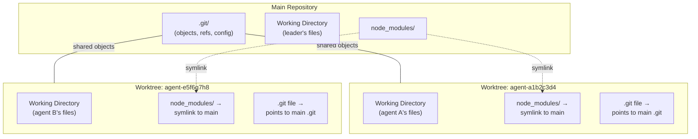
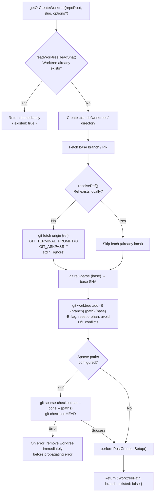
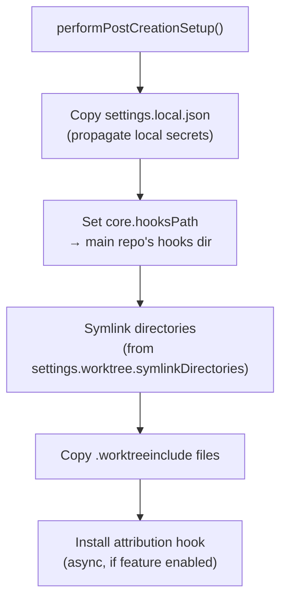
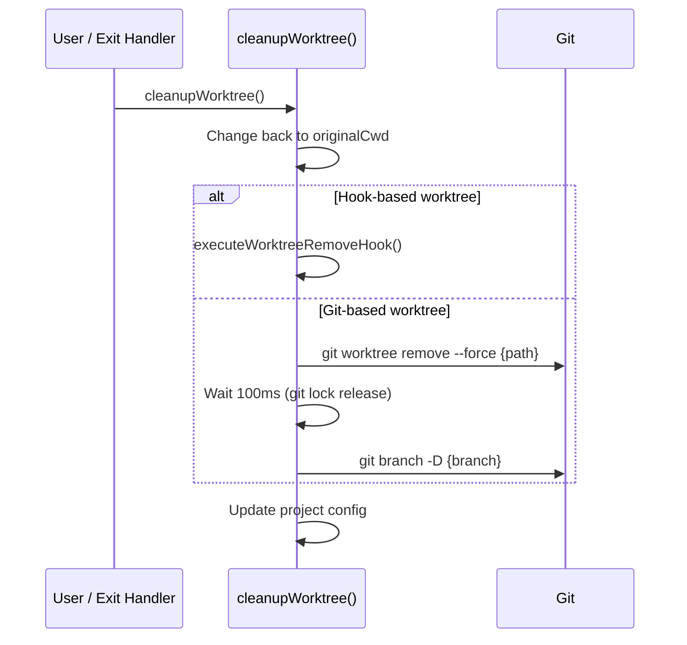
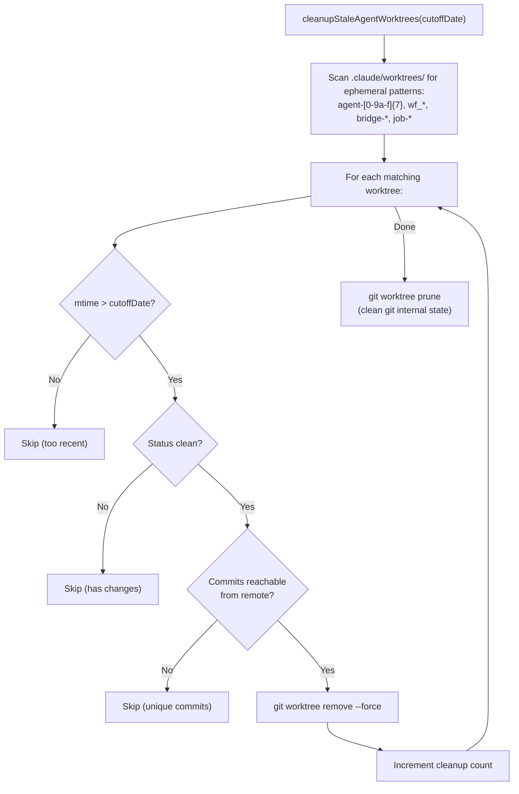

# Worktree Isolation

**Source**: `src/utils/worktree.ts`

Git worktrees provide filesystem isolation for agents. Each worktree is a separate working directory backed by the same git repository (shared `.git/objects`), allowing agents to make changes without interfering with the leader or each other.

## Architecture



## Worktree Session State

```typescript
interface WorktreeSession {
  originalCwd: string           // Where the leader started
  worktreePath: string          // Full path to worktree
  worktreeName: string          // Slug used for creation
  worktreeBranch?: string       // Git branch name
  originalBranch?: string       // Leader's branch at creation time
  originalHeadCommit?: string   // Base commit SHA
  sessionId: string             // Claude session UUID
  tmuxSessionName?: string      // Optional tmux session name
  hookBased?: boolean           // Worktree created via VCS hook
  creationDurationMs?: number   // How long creation took
  usedSparsePaths?: boolean     // Whether sparse checkout was applied
}
```

## Creation Flow



### Fast Resume Path

Before spawning a subprocess to check worktree existence, the system reads the worktree's `.git` pointer file directly from the filesystem:

```typescript
function readWorktreeHeadSha(worktreePath: string): string | null {
  // Read .git file (not directory) → points to main repo's worktree entry
  // Read HEAD from the worktree's gitdir
  // No subprocess needed (~0ms vs ~15ms for git rev-parse)
}
```

### Git Fetch Safety

All git fetch operations use safety measures to prevent hanging:
- `GIT_TERMINAL_PROMPT=0` — prevent password prompts
- `GIT_ASKPASS=''` — prevent SSH askpass
- `stdin: 'ignore'` — prevent stdin blocking

### Slug Validation

```typescript
function validateWorktreeSlug(slug: string): void {
  // Max 64 characters
  // Segments only [a-zA-Z0-9._-]
  // Rejects '.', '..', leading/trailing '/'
  // Allows nesting with '/' (e.g., 'user/feature')
}
```

For agent worktrees, the slug is `agent-{8-char-random-hex}`.

## Post-Creation Setup

**Function**: `performPostCreationSetup(repoRoot, worktreePath)`



### Settings Propagation
- Copies `settings.local.json` from the main repo to the worktree
- This propagates local secrets and project-specific overrides

### Git Hooks Configuration
- Sets `core.hooksPath` in the worktree's git config to point to the main repo's hooks directory
- Caches the existing value to skip the subprocess on subsequent worktree creates

### Symlinked Directories
- Configured via `settings.worktree.symlinkDirectories`
- Typically includes `node_modules/` to avoid duplicating hundreds of MB
- Symlinks point back to the main repo's directories

### .worktreeinclude Files
- Uses `git ls-files --directory` to find gitignored files that need to be in the worktree
- Filters via the `ignore` library (respects `.worktreeinclude` patterns)
- Copies matching files to the worktree

## Worktree Cleanup

### Session Worktree Cleanup



### Agent Worktree Cleanup

```typescript
async function removeAgentWorktree(
  path: string,
  branch?: string,
  gitRoot?: string,
  hookBased?: boolean
): Promise<boolean>
```

Lightweight version called from agent context with explicit `gitRoot`. Same logic: `git worktree remove --force` + `git branch -D`.

### Stale Worktree Cleanup



## Tmux Integration

**Function**: `execIntoTmuxWorktree(args)`

For the `--worktree --tmux` CLI flag combination, the system:

1. Validate worktree slug
2. Create/resume worktree via `getOrCreateWorktree()`
3. Generate tmux session name: `{repoName}_{branch}` (with `/` → `_`)
4. Set environment variables:
   - `CLAUDE_CODE_TMUX_SESSION`
   - `CLAUDE_CODE_TMUX_PREFIX`
   - `CLAUDE_CODE_TMUX_PREFIX_CONFLICTS`
5. Spawn tmux:
   - `tmux new-session -A -s {name} -c {dir} -- {executable} {args}`
   - `stdio: 'inherit'` for interactive use
   - If already inside tmux: `switch-client` instead of nested attach
